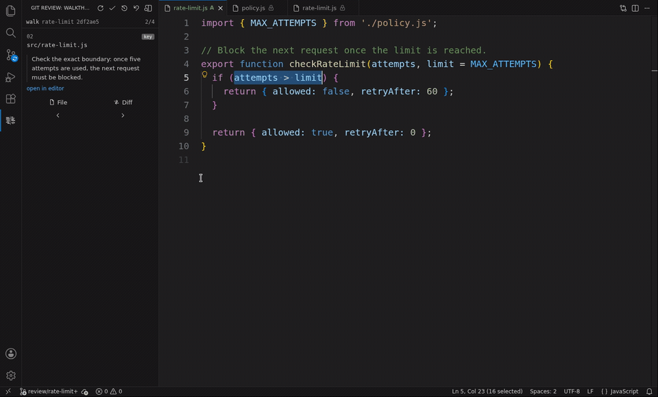

# git-review-workflow

> Revisá un pull request **editándolo y corriéndolo**, no solo leyéndolo. Todo el
> PR aparece en tu working tree como un único diff staged; después tus
> correcciones se extraen a una rama limpia automáticamente. Re-revisá solo lo
> que cambió.
>
> Y cuando el cambio lo escribió un **agente de IA**, el agente puede escribir
> también el **orden de lectura** — un walkthrough committeado junto al código
> que dice qué archivo leer primero y por qué. Los clientes visuales lo detectan
> solos y te llevan por el diff en ese orden, en vez de alfabéticamente.

[](LICENSE)
[](https://github.com/EzeVillo/git-review-workflow/releases)

[English](README.md) · **Español** · [Sitio web](https://ezevillo.github.io/git-review-workflow/)

Empezá desde su panel de VS Code, JetBrains o Visual Studio, o usá la interfaz de
terminal. Esas interfaces guían el flujo y dejan la [CLI](CLI.es.md) disponible
para scripts y usos avanzados.



**[Mirá la demo de 40 segundos en la web](https://ezevillo.github.io/git-review-workflow/#demo-vscode)** — seguí el orden de lectura,
corregí el código, corré los tests y llevate tu corrección a una rama aparte.

---

Revisar en una web está bien para dejar comentarios, pero es malo para realmente
*correr* y *editar* el código. Al iniciar una review, todo el PR aparece en tu
working tree como **cambios staged sin commitear**. Como es simplemente tu
working tree, abrís todo el PR en cualquier editor, leés el diff, editás inline
y corrés los tests. Cuando terminás, tus ediciones se extraen a una rama aparte,
limpiamente separadas del trabajo del autor. También podés volver a revisar solo
lo que cambió después de una actualización.

## Revisar lo que escribió un agente

Le pediste una feature a un agente. Volvió con catorce archivos cambiados y un
diff ordenado alfabéticamente — el único orden que garantiza no decir nada sobre
el cambio. Revisar eso es reconstruir, archivo por archivo, un razonamiento que
nunca viste.

El agente que hizo el cambio es el único que *sí* conoce ese razonamiento. Como
parte de la misma tarea, puede crear un walkthrough que ordena los archivos
cambiados, explica por qué importa cada uno y viaja con el PR.

Después abrís la review en uno de los clientes visuales. El cliente encuentra el
walkthrough solo, muestra el heads-up del agente sobre qué es delicado y te lleva
al primer archivo con su explicación. Las entradas esenciales aparecen marcadas
como clave y el panel recorre el resto del orden. Todo el PR sigue staged y
editable, así que corregís inline lo que encontrás y terminás con tus
correcciones en una rama aparte.

Para que salga automático, poné esta instrucción donde tu agente la vaya a leer
— su `AGENTS.md`, su `CLAUDE.md` o tu template de prompt:

> Después de hacer y commitear el cambio, agregá un walkthrough de lectura al
> PR. Ordená los archivos cambiados, escribí un *por qué* de una línea para cada
> uno, incluí un heads-up con lo delicado, marcá las pocas entradas que un
> reviewer no puede leer por arriba, validá el walkthrough y committealo junto
> con el código.

Lo que queda es un archivo Markdown committeado, así que también se lee tal cual
en GitHub para cualquiera que nunca instale esto. Y conseguís lo mismo **sin que
el autor se suba**: en un PR que no trae walkthrough, el panel te ayuda a pedirle
a tu propio agente que genere uno solo para tu review.

Revisar PRs escritos por agentes es también donde rinde el resto del flujo: traés
todo el cambio a tu working tree, lo corrés de verdad y corregís inline los code
smells y los errores sutiles en vez de escribir comentarios sobre ellos.

## ¿Por qué no usar la vista de PR de tu IDE?

La mayoría de las herramientas te dejan *ver* un PR. Esto resuelve dos cosas:
*actuar* sobre uno — editarlo y correrlo como cambios normales del working tree
y después devolver tus correcciones sin stash ni cherry-pick manuales — y
darle un **orden de lectura guiado**, algo que ni git ni GitHub ofrecen de
forma nativa.

|                                  |     Ver el PR      | Orden guiado + por qué, por archivo | Editar y correr como working tree | Extraer tus fixes automáticamente | Re-review incremental | Independiente del editor |
|----------------------------------|:------------------:|:-----------------------------------:|:---------------------------------:|:---------------------------------:|:---------------------------------:|:------------------------:|
| **git-review-workflow**          |         ✅          |                  ✅                  |                 ✅                 |                 ✅                 |                 ✅                 |            ✅             |
| `gh pr checkout` / `glab`        | ⚠️ checkout pelado |                  ❌                  |                 ✅                 |                 ❌                 |                 ❌                 |            ✅             |
| JetBrains *Review Pull Request*  |         ✅          |                  ❌                  |         ⚠️ solo en el IDE         |                 ❌                 |                 ❌                 |            ❌             |
| Extensión *GitHub PR* de VS Code |         ✅          |                  ❌                  |         ⚠️ solo en el IDE         |                 ❌                 |                 ❌                 |            ❌             |
| Web de GitHub / GitLab           |         ✅          |                  ❌                  |                 ❌                 |                 ❌                 |            ⚠️ parcial             |            ✅             |

Ninguna de las alternativas de arriba te da un **orden de lectura guiado por el
autor** — qué archivo leer primero, y por qué — en vez de una lista alfabética o
un diff pelado. El autor (a menudo un agente de IA) lo escribe una sola vez y lo
commitea junto con el PR. El panel del reviewer lo detecta solo y presenta los
archivos en ese orden. Ni siquiera necesitás que el autor o tu equipo se suban:
el panel te ayuda a crear tu propio orden de lectura para una review puntual.

Como el PR son simplemente cambios staged, cualquier cosa que lea un diff de Git
lo ve entero — incluidos agentes de IA como Claude Code o Codex que no tienen una
función propia para revisar PRs. Apuntás uno al diff staged y puede revisar o
corregir todo el PR ahí mismo.

Y para las cosas chicas — un rename, un typo, un nombre de variable más claro —
arreglarlo vos mismo es más rápido y menos burocrático que dejar un comentario y
esperar la ida y vuelta, sobre todo cuando ya estás mirando el PR en tu editor.
Como tus ediciones se extraen automáticamente, el arreglo te cuesta más o menos
lo mismo que habría costado el comentario. O le pasás el diff staged a un agente
y que haga el cambio por vos.

Si mayormente *comentás*, el panel nativo de PR de tu IDE alcanza. Si revisás
editando y corriendo el código — en cualquier editor o agente — esto es lo que
falta.

## Inicio rápido

Todas las interfaces manejan la misma CLI, así que instalala primero:

```sh
npm install -g git-review-workflow
```

Después elegí la interfaz desde la que querés trabajar:

| Interfaz | Empezá acá |
|----------|-------------|
| **VS Code** | [Instalá la extensión y abrí el panel de git review](https://marketplace.visualstudio.com/items?itemName=EzeVillo.git-review-workflow) |
| **IDE de JetBrains** | [Instalá el plugin y abrí la ventana de git review](https://plugins.jetbrains.com/plugin/33490-git-review-workflow) |
| **Visual Studio** | [Instalá la extensión y abrí el panel Git Review](https://marketplace.visualstudio.com/items?itemName=EzeVillo.gitreviewworkflow) |
| **Interfaz de terminal** | [Instalá y abrí la interfaz de terminal](tui/README.md) |

En un panel o en la interfaz de terminal, configurá una vez la rama base y elegí
**Start a review**. La interfaz te pregunta qué rama revisar y cómo recorrerla.
Editá y corré el cambio staged con tus herramientas habituales; después elegí
**Finish** para extraer tus correcciones a una rama aparte.

## Instalación

Los clientes visuales comparten una pequeña base de línea de comandos. El
[Inicio rápido](#inicio-rápido) de arriba ya cubre la instalación por npm;
descolapsá abajo para Homebrew, el instalador nativo de Windows o una opción sin
Node.

<details>
<summary>Métodos de instalación (npm, Homebrew, Windows, en una línea, PATH)</summary>

Elegí el método que mejor te quede. Las opciones por gestor de paquetes son las
más fáciles y **te configuran el `PATH` solas**.

### npm (recomendado)

Si tenés [Node.js](https://nodejs.org), esta es la instalación de un solo comando.
Te pone `git review` en el `PATH` y anda en Linux, macOS y Windows (en Windows los
comandos igual corren bajo Git Bash):

```sh
npm install -g git-review-workflow
```

Actualizá con `npm install -g git-review-workflow@latest`; desinstalá con
`npm uninstall -g git-review-workflow`. El autocompletado se configura igual que
en las otras instalaciones que no son Homebrew — mirá la nota más abajo.

### Homebrew (macOS / Linux)

```sh
brew tap EzeVillo/git-review-workflow https://github.com/EzeVillo/git-review-workflow
brew install EzeVillo/git-review-workflow/git-review-workflow
```

El autocompletado queda configurado automáticamente. Para actualizar a la última
versión: `brew upgrade git-review-workflow`.

### Windows (PowerShell)

Necesitás [Git for Windows](https://gitforwindows.org), que provee la shell
donde corren estos comandos. Abrí PowerShell y ejecutá:

```powershell
irm https://raw.githubusercontent.com/EzeVillo/git-review-workflow/main/web-install.ps1 | iex
```

Instala el comando en `~\.local\bin` y agrega esa carpeta al `PATH` de tu usuario
automáticamente. Abrí una terminal nueva cuando termine. Volvé a correrlo para
actualizar; para desinstalar:

```powershell
irm https://raw.githubusercontent.com/EzeVillo/git-review-workflow/main/web-uninstall.ps1 | iex
```

(Si tenés Node, `npm install -g git-review-workflow` también anda en Windows — los
comandos igual corren bajo Git Bash en ambos casos.)

### Instalación en una línea (Linux, macOS, WSL, Git Bash)

¿Sin gestor de paquetes? Esto descarga el comando y lo instala en `~/.local/bin`
— ni siquiera necesitás clonar el proyecto antes:

```sh
curl -fsSL https://raw.githubusercontent.com/EzeVillo/git-review-workflow/main/web-install.sh | sh
```

Volvé a correrlo para actualizar (siempre instala la última versión). Para
desinstalar (pasale el mismo `PREFIX` si lo cambiaste):

```sh
curl -fsSL https://raw.githubusercontent.com/EzeVillo/git-review-workflow/main/web-uninstall.sh | sh
```

### Interfaz de terminal (opcional)

La interfaz de terminal es un binario estático separado y necesita la CLI de
arriba. Instalalo desde el mismo tap de Homebrew:

```sh
brew install EzeVillo/git-review-workflow/git-review-ui
```

O pedilo explícitamente al usar uno de los instaladores en una línea (sin el
flag, esos instaladores siguen instalando solamente la CLI):

```sh
curl -fsSL https://raw.githubusercontent.com/EzeVillo/git-review-workflow/main/web-install.sh | GIT_REVIEW_WITH_UI=1 sh
```

```powershell
& ([scriptblock]::Create((irm https://raw.githubusercontent.com/EzeVillo/git-review-workflow/main/web-install.ps1))) -WithUi
```

La [guía de la interfaz de terminal](tui/README.md) explica cómo abrirla, sus
controles y la configuración de refresco alternativa para montajes de red.

<details>
<summary>Desde una copia descargada</summary>

Si clonaste o descargaste el proyecto, abrí su carpeta en una terminal y corré:

```sh
./install.sh
```

Instala el dispatcher `git review` en `~/.local/bin` (cambiá la ubicación con
`PREFIX=/usr/local/bin ./install.sh`). Los verbos viajan al lado suyo como
helpers privados, no como comandos sueltos en tu `PATH`. Lo deshacés cuando
quieras con `./uninstall.sh`. Para actualizar, simplemente hacé `git pull` dentro
del repo — el symlink toma los cambios automáticamente.
</details>

<details>
<summary>"command not found" — agregar <code>~/.local/bin</code> a tu PATH</summary>

Tu `PATH` es la lista de carpetas donde tu terminal busca cuando escribís un
comando. Homebrew, npm y el instalador de PowerShell agregan su carpeta por vos. La
instalación en una línea y la manual usan `~/.local/bin`, que en la mayoría de
los sistemas ya está en el `PATH`. Si no lo está, el instalador te deja un aviso
— agregalo **una sola vez** pegando una línea en el archivo de config de tu
shell:

| Si tu terminal usa…                 | Agregá esta línea al archivo…        | La línea a agregar                     |
|-------------------------------------|--------------------------------------|----------------------------------------|
| **bash**                            | `~/.bashrc`                          | `export PATH="$HOME/.local/bin:$PATH"` |
| **zsh** (default en macOS reciente) | `~/.zshrc`                           | `export PATH="$HOME/.local/bin:$PATH"` |
| **fish**                            | *(sin archivo — corré esto una vez)* | `fish_add_path ~/.local/bin`           |

¿No sabés cuál usás? Corré `echo $0`. Después de editar el archivo, **abrí una
terminal nueva** (o hacé `source` del archivo). Tu cliente visual ya puede
encontrar la CLI.
</details>

<details>
<summary>Git Bash en Windows — ¿error de SSL al instalar?</summary>

Si ves `schannel: next InitializeSecurityContext failed` o un mensaje de
`revocation check`, tu Git for Windows está usando el backend SSL de Windows.
Arreglalo una vez y volvé a correr el instalador:

```sh
git config --global http.sslBackend openssl
```

</details>

</details>

## Referencia de la CLI

Los paneles y la interfaz de terminal cubren el flujo normal. Para consultar
todos los comandos, flags, caminos de recuperación y flujos avanzados, mirá la
[referencia completa de la CLI](CLI.es.md).

## Requisitos

- Git 2.23+. Se recomienda Git 2.38+ para obtener la comparación más precisa
  cuando un PR incorpora contenido de su rama base.
- Un remoto de Git configurado.
- Una shell POSIX. En Linux y macOS es la de por defecto. En Windows los comandos
  corren bajo Git Bash o WSL, no en `cmd.exe` ni PowerShell.

## Contribuir

Reportes de bugs, fixes e ideas son bienvenidos. Mirá
[CONTRIBUTING.md](CONTRIBUTING.md) para cómo correr los tests y el proceso de
release.

## Licencia

[MIT](LICENSE) © EzeVillo
