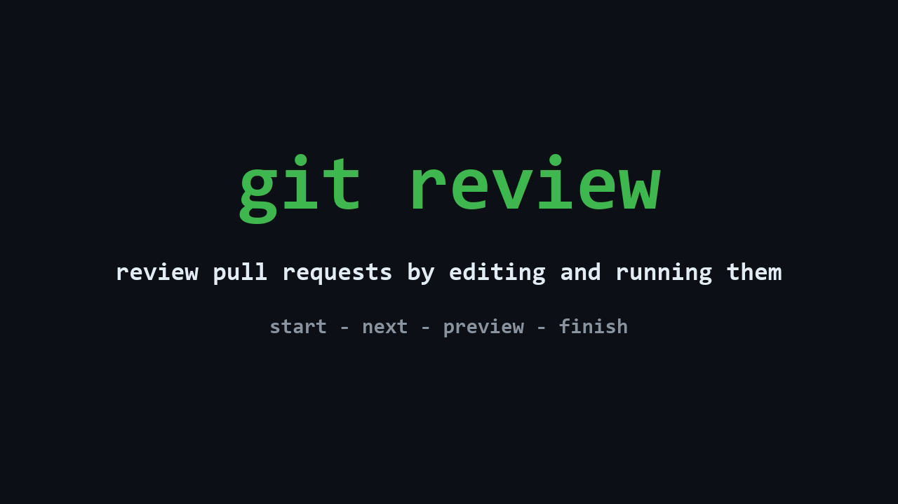

# git-review-workflow

> Review a pull request by **editing and running** it, not just reading it. The
> whole PR lands in your working tree as one staged diff; your fixes are then
> extracted onto a clean branch automatically. Re-review only what changed.
>
> And when an **AI agent** wrote the change, it can write the **reading order**
> too — a walkthrough committed next to the code saying which file to read first
> and why. `git review start` picks it up on its own and walks you through the
> diff in that order, instead of alphabetically.

[](LICENSE)
[](https://github.com/EzeVillo/git-review-workflow/releases)

**English** · [Español](README.es.md) · [Website](https://ezevillo.github.io/git-review-workflow/)

Clients: [VS Code extension](vscode-extension/README.md) · [JetBrains IDE plugin](jetbrains-plugin/README.md) · [Visual Studio extension](visualstudio-extension/README.md)

[](https://youtu.be/LsSQtNFnjRQ)

---

Reviewing in a web UI is fine for leaving comments, but poor for actually
*running* and *editing* the code. `git review start` puts the entire PR in your
working tree as **staged, uncommitted changes**: it creates a `review/<branch>`
branch whose working tree holds the PR tip, but whose `HEAD` sits at the
merge-base with your base branch. Because it is just your working tree, you open
the whole PR in any editor — read the diff, edit inline, run the tests — and when
you are done, `git review finish` pulls *your* edits back out onto a separate
`review-fixes/<branch>` branch (or onto the PR branch itself), keeping them
cleanly apart from the author's work. Re-review only the new commits after an
update with `--delta`.

> **All commands live under `git review <verb>`** — `git review start`,
> `git review finish`, `git review status`, and so on, the way `git bisect` and
> `git stash` group their verbs.

## Reviewing what an agent wrote

You asked an agent for a feature. It came back with fourteen changed files and a
diff sorted alphabetically — the one order guaranteed to say nothing about the
change. Reviewing that means reconstructing, file by file, reasoning you never
saw in the first place.

The agent that made the change is the one party that *does* know that reasoning,
and [`git review walkthrough`](#git-review-walkthrough) gives it somewhere to put
it. As part of the same task, right after writing the code, the agent runs:

```sh
git review walkthrough init                   # skeleton listing every changed file
# ...fills in the reading order and a why for each entry...
git review walkthrough build                  # validate, order, renumber
git add .review/walkthrough.md && git commit  # ships with the PR
```

Then you review it — nothing to enable, nothing to configure on your side:

```sh
git review start feature/rate-limit
```

`git review start` finds the walkthrough by itself: it prints the agent's
heads-up on what is delicate in this PR, then drops you on the first file with
the note on *why* it matters — the entries the agent flagged as essential are
labelled `(key)`; `git review next` moves through
the rest of the order. The whole PR stays staged and editable the entire time, so
you fix what you find inline and `git review finish` hands your corrections back
on a separate branch.

To make it automatic, put the instruction where your agent will read it — its
`CLAUDE.md`, `AGENTS.md`, or your prompt template:

> After making the change and committing it, run `git review walkthrough init`,
> fill in the reading order and a one-line *why* for every entry, the `## Heads-up`
> section with what is delicate in this PR, and a `> key` marker on the few
> entries a reviewer must not skim, then run `git review walkthrough build` and
> commit `.review/walkthrough.md`.

The result is a plain committed Markdown file, so it also just reads on GitHub
for anyone who never installs this. And you get the same benefit **without the
author on board**: on a PR that carries no walkthrough, point your own agent at
the diff and have it generate one just for your review — see
[Typical workflow](#typical-workflow).

Reviewing agent-written PRs is where the rest of the workflow pays off too: pull
the whole change into your working tree, actually run it, and fix the code smells
and subtle mistakes inline instead of writing comments about them.

## Why not just use my IDE's PR view?

Most tools let you *see* a PR. Two gaps this fills: *acting* on one — editing
and running it like ordinary working-tree changes, then handing your fixes back
without manual stashing or cherry-picking — and giving it a **guided reading
order**, something neither git nor GitHub offers natively.

|                                 |    View the PR    | Guided order + why, per file  | Edit & run as working tree | Auto-extract your fixes | Incremental re-review (`--delta`) | Editor-agnostic |
|---------------------------------|:-----------------:|:-----------------------------:|:--------------------------:|:-----------------------:|:---------------------------------:|:---------------:|
| **git-review-workflow**         |         ✅         |               ✅               |             ✅              |            ✅            |                 ✅                 |        ✅        |
| `gh pr checkout` / `glab`       | ⚠️ plain checkout |               ❌               |             ✅              |            ❌            |                 ❌                 |        ✅        |
| JetBrains *Review Pull Request* |         ✅         |               ❌               |       ⚠️ in-IDE only       |            ❌            |                 ❌                 |        ❌        |
| VS Code *GitHub PR* extension   |         ✅         |               ❌               |       ⚠️ in-IDE only       |            ❌            |                 ❌                 |        ❌        |
| GitHub / GitLab web UI          |         ✅         |               ❌               |             ❌              |            ❌            |            ⚠️ partial             |        ✅        |

None of the alternatives above give you an **author-guided reading order** —
which file to read first, and why — instead of an alphabetical file list or a
bare diff. The author (often an AI coding agent) writes it once, with
`git review walkthrough init`/`build`, and commits it alongside the PR; a
reviewer needs to do nothing special — `git review start` picks it up on its
own and drops them straight into that order, moving through it with
`git review next`/`prev`. See [`git review walkthrough`](#git-review-walkthrough)
for the full author-and-reviewer flow. You don't even need the author or your
team on board to benefit from it — see [Typical workflow](#typical-workflow)
for how to generate your own, just for one review.

Because the PR is just staged changes, anything that reads a Git diff sees all
of it — including AI coding agents like Claude Code or Codex that have no
PR-review feature of their own. Point one at the staged diff and it can review or
fix the whole PR in place.

And for the small stuff — a rename, a typo, a clearer variable name — fixing it
yourself is faster and less bureaucratic than leaving a comment and waiting for a
round-trip, especially when you are already looking at the PR in your editor.
Because your edits are extracted automatically, the fix costs about the same as
the comment would have. Or hand the staged diff to an agent and have it make the
change for you.

If you mostly *comment*, your IDE's native PR panel is enough. If you review by
editing and running the code — in any editor or agent — this is the gap it fills.

## Quick start

```sh
# 1. Install (needs Node.js; see Installation for Homebrew and a no-Node option)
npm install -g git-review-workflow

# 2. Tell it where PRs are integrated, once per repo
git config reviewworkflow.base develop

# 3. Stage a PR branch as a single diff, then open the repo in your IDE
git review start feature/login
# ...read and edit the staged diff in your editor, run tests...
git review finish              # extract your edits onto review-fixes/feature/login
```

Prefer Homebrew, a native Windows (PowerShell) installer, or an install that
does not need Node? See [Installation](#installation). For the full flow —
re-reviewing updates, walking a PR via a guided walkthrough or commit by
commit, cleanup — see [Typical workflow](#typical-workflow).

## Installation

These commands plug into `git` as a single subcommand — you run them as
`git review start`, `git review finish`, and so on. The [Quick start](#quick-start)
above already covers the npm install; expand below for Homebrew, the native
Windows installer, or a no-Node option.

<details>
<summary>Installation methods (npm, Homebrew, Windows, one-line, PATH, tab completion)</summary>

Pick whichever method matches your setup. The package-manager options are the
easiest and **set up your `PATH` for you**.

### npm (recommended)

If you have [Node.js](https://nodejs.org), this is the one-command install. It
puts `git review` on your `PATH` for you and works on Linux, macOS and Windows
(on Windows the commands still run under Git Bash):

```sh
npm install -g git-review-workflow
```

Update with `npm install -g git-review-workflow@latest`; uninstall with
`npm uninstall -g git-review-workflow`. Tab completion is set up the same way as
the other non-Homebrew installs — see the note below.

### Homebrew (macOS / Linux)

```sh
brew tap EzeVillo/git-review-workflow https://github.com/EzeVillo/git-review-workflow
brew install EzeVillo/git-review-workflow/git-review-workflow
```

Tab completion is configured automatically. To update to the latest release:
`brew upgrade git-review-workflow`.

### Windows (PowerShell)

You still need [Git for Windows](https://gitforwindows.org), which provides the
shell these commands run in. Open PowerShell and run:

```powershell
irm https://raw.githubusercontent.com/EzeVillo/git-review-workflow/main/web-install.ps1 | iex
```

This installs the command into `~\.local\bin` and adds that folder to your user
`PATH` automatically. Open a new terminal after it finishes. Re-run to update; to
uninstall:

```powershell
irm https://raw.githubusercontent.com/EzeVillo/git-review-workflow/main/web-uninstall.ps1 | iex
```

(If you have Node, `npm install -g git-review-workflow` works on Windows too —
the commands still run under Git Bash either way.)

### One-line install (Linux, macOS, WSL, Git Bash)

No package manager? This downloads the command and installs it into
`~/.local/bin` — you don't need to clone the project first:

```sh
curl -fsSL https://raw.githubusercontent.com/EzeVillo/git-review-workflow/main/web-install.sh | sh
```

Re-run to update (always installs the latest release). To uninstall (pass the
same `PREFIX` if you overrode it):

```sh
curl -fsSL https://raw.githubusercontent.com/EzeVillo/git-review-workflow/main/web-uninstall.sh | sh
```

### Terminal UI (optional)

The terminal UI is a separate static binary and needs the CLI above. Install it
from the same Homebrew tap:

```sh
brew install EzeVillo/git-review-workflow/git-review-ui
```

Or opt into it when using a one-line installer (without the flag, those
installers continue to install only the CLI):

```sh
curl -fsSL https://raw.githubusercontent.com/EzeVillo/git-review-workflow/main/web-install.sh | GIT_REVIEW_WITH_UI=1 sh
```

```powershell
& ([scriptblock]::Create((irm https://raw.githubusercontent.com/EzeVillo/git-review-workflow/main/web-install.ps1))) -WithUi
```

The seven platform archives are also attached directly to each
[`tui-v*` release](https://github.com/EzeVillo/git-review-workflow/releases).
Run it with `git review ui` from inside a repository. On network mounts whose
file notifications are unreliable, set a minimum refresh interval, for example
`git config reviewui.pollseconds 45`; every normal refresh resets that floor, so
it does not add polling while notifications are arriving.

<details>
<summary>From a downloaded copy</summary>

If you cloned or downloaded the project, open its folder in a terminal and run:

```sh
./install.sh
```

This installs the `git review` dispatcher into `~/.local/bin` (change the
location with `PREFIX=/usr/local/bin ./install.sh`). The verbs travel beside it
as private helpers, not as separate commands on your `PATH`. Undo it any time
with `./uninstall.sh`. To update, just `git pull` inside the repo — the symlink
picks up changes automatically.
</details>

<details>
<summary>"command not found" — adding <code>~/.local/bin</code> to your PATH</summary>

Your `PATH` is the list of folders your terminal searches when you type a
command. Homebrew, npm and the PowerShell installer add their folder for you. The
one-line and manual installs use `~/.local/bin`, which is already on the `PATH`
on most systems. If it isn't, the installer prints a note — add it **once** by
pasting one line into your shell's config file:

| If your terminal uses…            | Add this line to the file…       | The line to add                        |
|-----------------------------------|----------------------------------|----------------------------------------|
| **bash**                          | `~/.bashrc`                      | `export PATH="$HOME/.local/bin:$PATH"` |
| **zsh** (default on recent macOS) | `~/.zshrc`                       | `export PATH="$HOME/.local/bin:$PATH"` |
| **fish**                          | *(no file — just run this once)* | `fish_add_path ~/.local/bin`           |

Not sure which one you use? Run `echo $0`. After editing the file, **open a new
terminal** (or `source` the file). Run `git review -h` to confirm.
</details>

<details>
<summary>Tab completion (manual installs)</summary>

Homebrew sets this up for you. Otherwise, tell your shell to load the matching
file on start. Replace `/path/to/git-review-workflow` with where you downloaded
the project.

```sh
# bash — in ~/.bashrc
source /path/to/git-review-workflow/completions/git-review-workflow.bash

# zsh — in ~/.zshrc
source /path/to/git-review-workflow/completions/git-review-workflow.zsh

# fish — copy into fish's completions folder (no config line needed)
cp /path/to/git-review-workflow/completions/git-review-workflow.fish \
    ~/.config/fish/completions/
```

Then open a new terminal. Typing `git review ` and pressing **Tab** now offers
the verbs; `git review start ` offers your branch names.
</details>

<details>
<summary>Git Bash on Windows — SSL error during install?</summary>

If you see `schannel: next InitializeSecurityContext failed` or a
`revocation check` message, your Git for Windows is using the Windows SSL
backend. Fix it once, then re-run the installer:

```sh
git config --global http.sslBackend openssl
```

</details>

</details>

## Commands

> **How to read the syntax:** `<x>` is **required**, `[x]` is **optional**, and
> `a | b` means **pick one, not both**.

Every command is a verb under `git review`. Run `git review -h` for the list, or
`git review <verb> -h` for one verb's details.

`git review-ui` is the shell-friendly synonym for launching `git review ui`.

| Command                                                                                                                                      | What it does                                                                                                                                                                                                                                                                                                                                                       |
|----------------------------------------------------------------------------------------------------------------------------------------------|--------------------------------------------------------------------------------------------------------------------------------------------------------------------------------------------------------------------------------------------------------------------------------------------------------------------------------------------------------------------|
| `git review [-h \| --version]`                                                                                                               | List all verbs or print the installed version.                                                                                                                                                                                                                                                                                                                     |
| `git review ui`                                                                                                                              | Open the terminal interface for the current repository.                                                                                                                                                                                                                                                                                                           |
| `git review start [<branch>] [<base> \| --base <base> \| --delta \| --from <commit>] [--step \| --no-walk \| --keys] [--local \| --offline]` | Fetch `origin`, then stage the PR diff on a new `review/<branch>` branch (omit `<branch>` to review the current branch; enters walk mode if the PR carries a walkthrough; `--keys` restricts walk to entries marked `> key`; `--local` reviews your local branch but still diffs against origin's base; `--offline` also skips fetching and uses your local base). |
| `git review compare <a> <b> [--step \| --no-walk \| --keys]`                                                                                 | Stage the diff between two commit-ish (tags, commits, branches) read-only, to read or walk it. `git review finish` refuses — there is nothing to write back.                                                                                                                                                                                                       |
| `git review walkthrough (init [--base <base>] [--force] [--stdout] [--porcelain] \| build [--check] [--from <file> \| --from -])`                                 | Author a reading walkthrough for the current branch's PR — a guided order of the changed files with a note on each, committed as `.review/walkthrough.md`. Run `init` again after the PR moves on and it **updates** what is there: entries whose file is still in range keep their number, their why and their `> key`, files that entered the range arrive as placeholders, and entries whose file left it are dropped and named (`--force` discards the lot and writes a blank skeleton instead). `build` stamps a `> at:` anchor under each entry, so a later `build` can name the whys written against a version of their file that no longer exists — a note, never a failure. `--stdout` prints the skeleton instead of writing it and `--from` installs a filled-in one from a file or standard input, so an agent can write the reading order without touching your working tree. |
| `git review walkthrough draft [--local \| --offline] [--delta] [--force] [--stdout] [--porcelain] [--] [<branch>]`<br>`git review walkthrough draft --build [--from <file> \| --from -] [--local \| --offline] [--delta] [--force] [--] [<branch>]`                                               | Write your own reading order for someone else's PR, kept out of the working tree — nothing is staged, committed or undone, and running it again updates what is there instead of refusing. `git review start` then reads it instead of the PR's walkthrough. `--build` validates and renumbers it. `--stdout` prints the skeleton instead of writing it (nothing is created anywhere), `--porcelain` replaces the summary line with a `merged` record of what was kept, added and dropped so a caller can write its own sentence, and `--build --from` installs a filled-in one from a file or standard input, so an agent can write the reading order without touching your gitdir.                                                                                                                                 |
| `git review walkthrough guide [--team] [--delete]`                                                            | Create or remove an authoring guide: prose about **content** — which entries deserve `> key`, how to write a why, what belongs in the heads-up. Bare, it creates **yours** (`<git-common-dir>/review-walkthrough-guide.md`), outside the working tree, so it is never staged, committed or extracted by `finish`. `--team` creates the repository's shared one (`.review/walkthrough-guide.md`, committed with the code) and is refused inside a review. `--delete` removes yours; the shared one is a tracked file, so that is `git rm` plus a commit. Both are created **empty** — the command prints what to write, so nothing left in the file can be mistaken for the conventions. |
| `git review next` / `git review prev`                                                                                                        | Move a `--step` or walkthrough review to the next / previous entry.                                                                                                                                                                                                                                                                                                |
| `git review status [--porcelain \| --why <path>]`                                                                                            | Show the state of the review on the current branch (`--porcelain` for machine-readable output, including a `finish` record when a closure is mid-conflict; `--why <path>` for a walkthrough entry's explanation).                                                                                                                                                  |
| `git review list [--porcelain]`                                                                                                              | List every review in progress and every saved one (current branch marked `*`; `--porcelain` also reports unresolved finishes as `pending` or `conflict`).                                                                                                                                                                                                          |
| `git review save`                                                                                                                            | Pause the current review as `review-saved/<branch>` and return to where you started.                                                                                                                                                                                                                                                                               |
| `git review continue [branch]`                                                                                                               | Resume a review saved with `git review save`.                                                                                                                                                                                                                                                                                                                      |
| `git review finish [--onto-source] [--resume \| --abort [--force]]`                                                                          | From a `review/*` branch, extract your edits onto `review-fixes/<branch>` (or the PR branch); `--abort` undoes the last finish.                                                                                                                                                                                                                                    |
| `git review preview [--stat]`                                                                                                                | Show the edits you have made so far — the diff `finish` would extract — without committing or switching branch.                                                                                                                                                                                                                                                    |
| `git review abort`                                                                                                                           | Cancel the current review and return to where you started.                                                                                                                                                                                                                                                                                                         |
| `git review clean [--keep-fixes \| --fixes-only] [branch]`                                                                                   | Delete the `review/*` (and by default `review-fixes/*`) branches for `<branch>`, or all of them; `--keep-fixes` leaves `review-fixes/*` alone, `--fixes-only` takes only those.                                                                                                                                                                                    |
| `git review forget --delta ([--] <branch> \| --all \| --stale [--dry-run])`                                                                  | Discard the `--delta` marker for one branch, all of them, or only stale ones.                                                                                                                                                                                                                                                                                      |
| `git review forget --saved ([--] <branch> \| --all) [--dry-run]`                                                                             | Discard a review saved with `git review save`.                                                                                                                                                                                                                                                                                                                     |
| `git review forget --draft ([--] <branch> \| --all \| --reviewed) [--dry-run]`                                                                             | Delete a walkthrough you drafted for someone else's PR.                                                                                                                                                                                                                                                                                                            |
| `git review config [<key> [<value>]] [--unset <key>] [--porcelain [<branch>]]`                                                               | Read or write the product's config (`base`, `remote`); `--porcelain` also lists candidate branches to review.                                                                                                                                                                                                                                                      |

<details>
<summary id="git-review-start"><code>git review start</code></summary>

Has two independent axes — **range** (where the review starts) and **layout**
(`--step` or not), which compose freely.

- `<branch>` — the branch to review. **Omit it to review the branch you currently
  have checked out** — git's own default (like `push`, `status`, `log`). It only
  resolves the name; the mode is still chosen by flags, so pair the omitted branch
  with `--local` to review your local work. Without `--local` it reviews
  `origin/<branch>` — if that differs from your checked-out branch you get a note,
  since you would be reviewing a different snapshot than you have. With no branch,
  fails on a detached HEAD or while on a `review/*` branch.
- `base` — commit-ish to diff against: a branch, a **tag**, or a commit. Taken
  from `reviewworkflow.base` (see below); a positional argument overrides it.
  **Required for a full review** — there is no built-in default, so a full review
  with no base set fails and asks you to configure one. Not used with `--delta` or
  `--from`, which carry their own starting point — passing an explicit base
  alongside them is an error (a base from config is simply ignored).
- `--base <base>` — the base to diff against, as a flag. Use it to pass a base
  while letting `<branch>` default to the current branch — e.g.
  `git review start --base develop` reviews the branch you are on against
  `develop` (the lone positional is always taken as `<branch>`, so the flag is how
  you reach the base without naming the branch). Cannot be combined with a
  positional base.
- `--delta` — review only the commits added **since your last review** of this
  branch, instead of the whole PR. Perfect for re-reviewing an updated PR. A
  **completed** review keeps its recorded tip through `git review clean`; an
  **abandoned** start (cleaned or aborted without finishing) rolls the marker
  back so `--delta` never skips commits you never reviewed. Discard the marker
  explicitly with `git review forget --delta`.
- `--from <commit>` — review only the commits **after `<commit>`**. Handy when
  there is no recorded review to delta from, or to pick an exact starting point.
  Mutually exclusive with `--delta`.
- `--step` — review the range **one commit at a time** (combine with `--delta`
  or `--from` to walk just those commits). You start on the first commit after
  the merge-base; the command prints its author message. Edit files, then run
  `git review next` to bank your edits and move to the next commit with a clean
  tree. When the commits run out, run `git review finish` and all your banked
  edits are replayed onto the PR tip — exactly as in a whole-PR review.
- **Walk mode (automatic).** If the PR carries a walkthrough
  (`.review/walkthrough.md`, written by the author with
  [`git review walkthrough`](#git-review-walkthrough)), `git review start` enters
  **walk mode**: the very same staged, editable whole-PR review, plus a guided
  reading cursor over it. It prints the author's heads-up — what is delicate in
  this PR, read once before the first file — then the first entry: a file and the
  author's note on why it matters, labelled `(key)` when it is one of the few the
  author flagged as essential. You move through the reading order
  with `git review next` / `git review prev`. The cursor is *only* a reading
  position: it never stages, resets or hides anything, so you edit and
  `git review finish` exactly as in a whole review. The entries are filtered to
  the review's actual range, so a walkthrough that no longer matches (e.g. an old
  one under `--delta`) simply degrades — a broken or stale walkthrough **never**
  fails a review; at worst it falls back to a plain whole review with a note. A
  file that changes in the range but has no entry of its own — a stale
  walkthrough is the common case — is not left out either: it is appended to the
  end of the reading order, marked `(uncovered)` instead of `(key)`, so a review
  never reaches `git review finish` with PR files you never saw — including the
  committed walkthrough itself, which joins that same uncovered tail: a
  walkthrough can never annotate itself, but it is content the PR adds like any
  other file, so it is never the one file no review shows you.
- `--no-walk` — ignore any walkthrough and review the whole diff plainly. `--step`
  also takes precedence over walk (they are two spellings of the same layout
  axis), so `--step` wins with no error — it just prints a note that the PR's
  walkthrough is being ignored (silenced by also passing `--no-walk`).
- `--keys` — walk mode restricted to entries marked `> key`. The reading
  cursor, `next`/`prev`, and status list only those essential files (in
  walkthrough order). Requires a walkthrough with at least one key in range;
  cannot be combined with `--step` or `--no-walk`. The full PR is still staged —
  only the guided path is shorter. A focused first pass, not a claim that the
  rest of the PR does not matter.
- `--local` — review your **local** `<branch>`, including unpushed commits,
  instead of `origin`'s copy. The base is a different concern — it's the shared
  merge target — so it is still fetched and diffed from `origin`'s copy even
  under `--local`; only your local branch changes. Lets you review your own
  work before pushing. It keeps its own `--delta` marker, separate from the
  remote one, so local and remote reviews of the same branch name never
  overwrite each other's progress.
- `--offline` — like `--local`, but also skips fetching entirely and resolves
  the base from your local branches too, for the rare case where you have no
  network access at all. Implies `--local`.
- Always updates from `origin` first and **fails** if it cannot (unless
  `--offline`). Without `--local`/`--offline` the review is built from
  `origin/<branch>`, never a stale local copy. If a local branch of the same
  name points somewhere else, it prints a note: the review reflects the remote,
  not your checkout, and a later `git review finish --onto-source` would refuse
  until your local branch matches.
- Refuses to run if you have local changes (tracked **or** untracked, non-ignored)
  — start from a clean branch.
- **Merges of the base branch are excluded.** If the author merged the base
  (e.g. `develop`) into the PR, that merged-in content is left out of the review
  in every mode, so you only see the author's own changes.
- `--` ends option parsing, the usual git convention: everything after it is
  treated as a positional argument, so a branch whose name starts with `-` can
  still be reviewed (e.g. `git review start -- --weird develop`).

</details>

<details>
<summary><code>git review compare</code></summary>

Stage the diff between two commit-ish — two tags, two commits, two branches — as
one read-only review, so you can read it inline or walk it commit by commit with
the same UX as a real review, without `git diff | less`.

```sh
git review compare v1.0 v2.0          # stage the diff between two releases
git review compare v1.0 v2.0 --step   # ...and walk it commit by commit
```

- It diffs `<a>..<b>`: `<a>` is the lower bound (where the review starts), `<b>`
  the tip whose content fills the working tree. Both are resolved to commits, so
  tags and raw SHAs work, not only branch names.
- It is **read-only by design**. The whole edit→finish half of the workflow needs
  a writable branch to write back to, and a tag or a commit is not one — so
  `git review finish` on a compare refuses explicitly ("this review is read-only,
  there is nothing to write back"). Use `git review abort` to end it.
- `--step` walks it one commit at a time, exactly like `git review start --step`,
  with `git review next` / `git review prev`.
- If `<b>`'s tree carries a walkthrough, `compare` enters walk mode too, just like
  `git review start`, and stays read-only. `--no-walk` opts out.

</details>

<details>
<summary id="git-review-walkthrough"><code>git review walkthrough</code></summary>

The one thing neither git nor GitHub offers: an **author-written reading order**
over a PR. As the author (often an AI coding agent), you set the order in which
the changed files should be read and annotate each with *why* it matters; a
reviewer who runs `git review start` on the PR is then dropped into
[walk mode](#git-review-start) and reads it in that order.

The walkthrough is a committed sidecar, `.review/walkthrough.md` — plain Markdown,
readable on GitHub, that merges with the PR. There are two subcommands:

```sh
git review walkthrough init     # write a skeleton listing every changed file
# ...fill in the order and the whys...
git review walkthrough build    # validate, order by your numbers, renumber 1..N
```

- `init` writes a deterministic skeleton with **every file** changed vs the base
  (the same range a reviewer will see), each as `## ?. <path>` plus a
  `<!-- why: -->` placeholder, headed by a `## Heads-up` section with its own
  placeholder. `--base <base>` overrides `reviewworkflow.base`.
- **A walkthrough that arrived with a merge is not reconciled, it is replaced.**
  Your PR merges, the sidecar travels into the base with it, you branch again and
  touch one of the same files: that entry still carries a why about a change that
  already shipped. `init` asks git whether the tip that wrote it is already in the
  base, and when it is, writes a fresh skeleton and says so — no `--force` needed,
  because the file is tracked and the old one is one `git checkout --` away. The
  panel calls that state *from a merged PR* rather than *may be out of date*:
  nothing fell behind, it belongs to a range that closed.
- **Run `init` again whenever the PR moves on.** A walkthrough is written when the
  PR is finished, and then the PR keeps changing — review comments come back and
  three more files change. `init` over an existing walkthrough **updates** it:
  every entry whose file is still in range keeps its number, its why and its
  `> key`, files that entered the range arrive as `## ?.` placeholders to fill in,
  and entries whose file left it are dropped and named on stderr (they are in git;
  `git checkout -- .review/walkthrough.md` brings them back). `--force` is the
  other direction: discard everything and write a blank skeleton.
- You (the author) do only the non-mechanical part: replace each `?` with an order
  number and each placeholder with a short note.
- **`## Heads-up`** is the one thing a reviewer reads before opening a file: the
  invariants this PR can break, the subtle or risky parts, what to be suspicious
  of. `git review start` prints it on entry. Delete the whole section if nothing
  in the PR is delicate — an empty section is worse than none.
- **`> key`** marks the essential entries. Write it on a line of its own as the
  first line of the why on the few files that carry the change — the ones a
  reviewer must not skim — and leave every other entry unmarked; generated files,
  lockfiles and mechanical renames are exactly what stays unmarked. It takes no
  value: the why says the rest. Walk mode labels those entries `(key)` and counts
  them on entry. Reviewers can start with `git review start --keys` to walk only
  those entries. The marker only works while it stays selective, so `build` notes
  it when every entry is marked (or when a long walkthrough marks none).
- **`> at:`** is written by `build`, not by you: an anchor recording the version
  of each file its why was written against. On the next `build` (or
  `build --check`), any entry whose file has changed since is named — the whys
  worth rereading. The drift check compares the *set* of paths, so without this a
  PR that keeps changing the files it already annotates passes in green with prose
  describing the first draft of each one. It is a **note, never a failure**:
  touching a file without rewriting its why is often right, and a check that goes
  red over it is one people learn to switch off. Reviewers never see the marker.
- **Authoring guides (optional):** conventions for **content only** — which files
  to mark `> key`, how to write whys and the Heads-up, local habits. They do
  **not** change the walkthrough format, and `build` does not validate them: the
  CLI detects them and names them, and the agent filling the walkthrough in is
  what reads them. There are two, and they answer different questions:

  |         | Whose                              | Where                                              |
  |---------|------------------------------------|----------------------------------------------------|
  | shared  | how **this project** wants its PRs annotated | `.review/walkthrough-guide.md`, committed with the code |
  | yours   | how **you** annotate               | `<git-common-dir>/review-walkthrough-guide.md`, outside the working tree |

  Yours is in the gitdir for the same three reasons the reviewer's draft is: it
  never shows up in `git status`, it is never staged or committed, and `finish`
  cannot carry it into `review-fixes/` — which it would, since extraction is
  `git add -A`. Create either with
  [`git review walkthrough guide`](#git-review-walkthrough).

  **Both apply when both have content, and yours wins where they disagree** — the
  same precedence a draft has over the author's walkthrough. `init` and `draft`
  name the ones in force in the skeleton itself and report them on stderr — and so
  does `build`, which is the verb that enforces the rule a guide most often carries
  ("mark few entries key"). The skeleton names them two ways: written to a file it
  gives the **paths**, and under `--stdout` it **inlines the content**, because that
  skeleton travels down a pipe and the absolute path of a gitdir is not something the
  agent on the other end can necessarily open. A guide
  that is empty or holds only whitespace is not a guide: it is reported as empty
  and nothing is applied. Both are resolved from the repository you are standing
  in, `draft` included — the conventions of whoever is annotating, not a guide
  from the PR tip. `clean` never touches either.
- `build` validates the file, orders the entries by your numbers, renumbers them
  `1..N` and rewrites it, preserving the heads-up. `--check` validates **without
  writing** and exits non-zero on any problem — meant for CI. It fails if any
  `?.`, `<!-- why` or `<!-- heads-up` placeholder is left, if `> key` was given a
  value, if a path appears twice, if an entry heading is not in the exact
  `## <N>. <path>` form, or on **drift**: the set of paths must match the PR's
  changed files exactly (excluding `.review/`).

Filling in the order and the whys is a great fit for an AI coding agent — point
one at the diff and let it write the placeholders. That works on either side:
the PR's author can have an agent draft the walkthrough alongside the change,
and it may be **even more useful on the reviewer's side** — a human reviewer
would need to already understand the PR to hand-write a reading order for it,
which defeats the purpose, whereas an agent that reads the whole diff can write
that order *before* you've read a single file (see the solo-review case in
[Typical workflow](#typical-workflow)).

### Drafting one for someone else's PR

Most PRs carry no walkthrough, and you can't commit one to a branch that isn't
yours. `git review walkthrough draft` writes the same skeleton for a branch you
name, **outside the working tree** — under `$GIT_DIR`, where `git status` never
sees it, `git review start` never trips over it, and `git review finish` can
never carry it into your extracted edits. There is nothing to stage, and nothing
to undo:

```sh
git review walkthrough draft feature/checkout          # skeleton for someone else's PR
# ...fill in the order and the whys (by hand, or hand it to an agent)...
git review walkthrough draft --build feature/checkout  # validate, order, renumber
git review start feature/checkout                      # enters walk mode on your order
```

- Takes the branch as an argument, like `git review start` — you're standing on
  the base, not on the PR — and defaults to the branch you are on, or, run from
  inside a review, to the branch that review is reading. `--local`,
  `--offline` and `--delta` resolve the range exactly as `start` does, so the
  skeleton lists precisely the files your review will cover. Never fetches.
- `--build` applies the same validation `build` does for the author's sidecar:
  placeholders, drift, duplicate paths, `> key` with a value. It's a quality
  gate, not a gate — an unvalidated draft is already readable.
- **Run it again whenever the PR moves on.** A draft cannot fall out of step
  *during* a review — `start` freezes the tip — but it outlives that review, and
  the next one is over a range that moved. Running `draft` over an existing one
  **updates** it on the same terms as `init`: every entry whose file is still in
  range keeps its number, its why and its `> key`, the files the PR changed since
  arrive as `## ?.` placeholders, and entries whose file **the PR no longer
  changes** are dropped and named. `--delta` narrows what a review *reads*,
  never what your order is allowed to hold: entries for files the PR changes in
  commits you have already read are kept, so pointing it at an order you wrote
  for the whole PR costs you none of it. `--force` is the way back to a blank
  skeleton — and unlike the author's sidecar this file is not in git, so that
  one has no way back.
- Your draft **takes precedence** over the PR's own walkthrough for as long as it
  has something in it, and `git review status` marks the review `walk (draft)` so
  a reading order you wrote is never mistaken for the author's. An empty draft is
  not a reading order: the review falls back to the PR's walkthrough, and says
  which of the two it did. Drafting over a PR that already has one says so; delete
  the draft to go back to theirs.
- **Edit it mid-review.** It's a file, not a frozen sidecar, so you can rewrite
  your order (or unmark a `> key`) while the review is open. If that leaves the
  cursor past the last entry, `git review` re-seats it on the last one and tells
  you — it never mistakes your editing for a stray `git commit`.
- It's yours and it's local, so nothing throws it away behind your back: it
  outlives `abort`, `finish` and `git review clean` (start the branch again and
  your reading order is still there), `git review save` files it with the paused
  review, and the two commands that discard it are the ones you point at it —
  `git review forget --draft <branch>` (or `--all`), and `git review forget
  --saved`, which takes the copy that review filed with the review and says so —
  a draft belongs to a branch, so two paused reviews of one branch share the
  name, and only the one that wrote it takes it, back or away. If
  you write a new draft for a branch while its review is paused, `git review
  continue` refuses rather than overwrite one of the two — drop whichever you
  don't want and resume. `git review save` refuses the mirror case — when you
  have a draft to file and another paused review already has one filed under that
  name — and says so when the one it replaces is an archived draft no review can
  reclaim.

#### Handing the draft to an agent

`--stdout` and `--build --from` are the two ends of one circuit: they let
something other than you fill the reading order in **without ever writing into
your gitdir**.

```sh
git review walkthrough draft --stdout feature/checkout > order.md   # creates nothing
# ...an agent fills order.md in, wherever it likes...
git review walkthrough draft --build --from order.md feature/checkout
# or read it from standard input:
git review walkthrough draft --build --from - feature/checkout < order.md
```

- **`--stdout`** prints exactly what the file would have held and creates
  nothing — no draft, no directory, not even a temp file; `git status` is
  identical before and after. Every note goes to stderr, so redirecting stdout
  gives you a valid file with nothing else in it. It prints over an existing
  draft too, and leaves that draft untouched: printing cannot destroy anything.
  The one passage that differs from the written form is the closing line, which
  under `--stdout` names `--build --from` — the command that installs *what you
  were just handed*, rather than one that would quietly rebuild some other file.
- **`--build --from <file>`** (or `-` for standard input) validates that content
  with the **same eight rules** as any other draft, against the same range
  resolved by the same `--local` / `--offline` / `--delta` flags, and installs it
  in the canonical place. From there it is a draft like any other: `status` says
  `walk (draft)`, `save` files it with a paused review, `forget --draft`
  discards it. CRLF endings and a UTF-8 BOM — what an agent writing from
  PowerShell produces — are normalised, not treated as drift.
- **Nothing is written unless everything passed.** Whether a stored draft exists
  is settled *before* the source is read, so a refusal never costs you the input
  you piped in; and an unreadable file, empty input or any validation rule
  leaves the draft you already had byte for byte as it was.
- `--force` is what lets `--build --from` replace a draft you already wrote.
  The combinations that cannot mean anything (`--stdout` with `--build` or
  `--force`, `--from` without `--build`, `--from` twice) are refused up front,
  before anything is touched.

The author has the same circuit on their side, and it exists for the same reason:
the skeleton's own instructions say whoever fills a walkthrough in is usually an
agent.

```sh
git review walkthrough init --stdout > order.md   # creates nothing
# ...an agent fills order.md in...
git review walkthrough build --from order.md      # or --from - to read stdin
```

`init --stdout` prints the skeleton — the update, if a walkthrough is already
there — and touches nothing; `build --from` validates it by the same rules as
any other build and installs it. Unlike the draft side it takes no `--force`:
`build` already rewrites `.review/walkthrough.md` on every ordinary run, so
asking consent here would make the flag reflex typing, and the sidecar is a
tracked file — `git checkout --` is the way back.

**git review never writes the walkthrough for you and never talks to any
service.** It gives you the skeleton with the brief already written into it, and
validates what comes back. Who fills it in — you, an agent, whatever you like —
is entirely your call.

The walkthrough is built from **committed history** (`base..HEAD`), not your
working tree: commit the PR changes before authoring it. `init` and `build` never
see uncommitted work — they refuse with a hint when nothing is committed, and warn
when you have uncommitted changes on the side.

The file format `build` produces and `start` reads:

```markdown
# Walkthrough

## Heads-up

Sessions now expire; anything that cached a token is suspect.

## 1. src/auth/session.c

> key
Read this first: it defines the token shape everything else depends on.

## 2. src/auth/login.c

Then the login flow that consumes it — note the new error path.
```

Each entry is a `## <N>. <path>` line (the path exactly as git reports it, written
plainly — a name with non-ASCII characters goes in as-is, never C-escaped)
followed by its free-text *why*, up to the next entry, optionally led by the
reserved `> key` marker. Everything above the first entry is the preamble
(the `## Heads-up` section); the parser ignores it and `build` preserves it
verbatim, minus HTML comments. Granularity is per file in v1.

**The instruction block.** Both skeletons — the author's and the reviewer's —
open with an HTML comment whose first line starts `<!-- git-review-range:`. It
names the range in **resolved objects** (the tip's SHA, the lower bound's OID and
its type, `commit` or `tree`), records the origin and range flags the skeleton
was generated with, says which working tree it was generated from, and lists the
four `git` commands that show, for any file in the list, what the PR does to it
and what it looks like on either side.

It is there because whoever fills a skeleton in — often an agent — is standing in
a working tree that holds the wrong bytes for the job: from the base branch the
listed files are still at their pre-PR content, so reading them there produces
confident prose about the old code, with nothing failing to say so.

- It is **regenerated** by every `build` / `draft --build`, from the range that
  run just validated, so it never describes a range that has moved on.
- It is **never shown to the reviewer**: `git review start` and
  `git review status --why` do not print it, and it does not render on the PR —
  it is an HTML comment.
- It is **neutral for validation**: none of the rules above look at it, and
  deleting it by hand leaves a perfectly valid walkthrough (you just lose the
  range record next time you re-annotate).
- **Nothing in it is run for you.** Those are commands for whoever is annotating
  to run; git review does not execute them, before or after, and does not talk
  to any service.

</details>

<details>
<summary><code>git review next</code> / <code>git review prev</code></summary>

Move a `--step` or walkthrough review forward or backward. In `--step` mode each
move banks the current commit's edits and restores any edits banked on the commit
you move to, so you can walk back and forth without losing work. In walk mode they
just move the reading cursor — your edits live in the working tree the whole time
and are never touched.

</details>

<details>
<summary id="git-review-status"><code>git review status</code></summary>

Shows the current review: source PR, mode, and — in `--step` mode — which commit
you are on (`[k/N]`) and which steps have banked edits. In walk mode it shows the
reading cursor: `walk  [k/N] on <path>`. In whole mode (no walkthrough — the
default) it lists the files the range touches, numbered, with no cursor; an
empty range says so explicitly instead of printing nothing.

- `--porcelain` — machine-readable output for scripts and editor integrations:
  stable, tab-separated lines (see below). Read-only, exactly like the human
  output — it never mutates config, refs or the working tree.
- `--why <path>` — print *only* the walkthrough's explanatory text for `<path>`,
  nothing else on the stream: no label, no other data. Walk mode only.

**Exit codes** — not just under `--porcelain`: the same codes come from every
verb that detects the situation (`status`, `list`, `abort`, `finish`, `preview`,
`save`, and `next`/`prev` for `3`), so a script never has to special-case which
command it ran:

| Code | Meaning                                                                                                           |
|------|-------------------------------------------------------------------------------------------------------------------|
| `0`  | success                                                                                                           |
| `1`  | error — missing or corrupt review metadata, invalid usage, not a git repository                                   |
| `2`  | HEAD is not on a review branch (the common, unremarkable case)                                                    |
| `3`  | the walkthrough cursor is out of range because HEAD moved off the review's base — recover with `git reset --soft` |

**`--porcelain` format** — one line per record, fields separated by a tab, the
record's type first and a path or id (when it has one) immediately after that —
never last, so new fields are always appended at the end of the line. A consumer
should ignore any trailing field it does not recognize on a line type it knows,
and any line whose type it does not recognize: the format only ever grows.

```
state	<branch>	<source>	<tip>	<mode>	<walkthrough>[	<position>	<total>	<recorded>	<current>[	<essential>]]
finish	conflict	<onto>
draft	<path>
entry	<position>	<id>[	<essential>	<annotated>|<banked>]
subject	<position>	<subject>
author	<position>	<author>
base	<base>
```

- `state` — exactly one line, always first. `mode` is `whole` \| `step` \| `walk`.
  `walkthrough` is `none` \| `applied` \| `degraded` (always `none` in step mode,
  since the field is positional there). `position`/`total`/`recorded`/`current`
  appear only with a cursor (`step`/`walk` mode); `current` is a short commit SHA
  in step mode, a path in walk mode. `total` is the live count, derived right now;
  `recorded` is what was recorded when the review started — they differ once the
  base has drifted, even while the cursor is still in range. `essential` (`1`/`0`)
  appears only in walk mode.
- `finish` — only while a `git review finish` is **stopped mid-conflict** on this
  review branch (`state` is always `conflict` here; a completed finish already
  moved `HEAD` off `review/*`, so `status` never sees it — use `list` for that).
  `onto` is `1` if the finish used `--onto-source`, `0` otherwise. The whole
  record is omitted when no closure is in progress. Consumers must not offer
  sequence navigation while this record is present.
- `draft` — zero or one: present exactly when this review is reading **your own**
  walkthrough draft rather than the PR author's, which is the same condition the
  human-readable `walk (draft)` marks. `<path>` is the absolute path of that
  draft, already resolved — a client opens it and never builds one. Loose drafts
  with no review of their own are not reported here; that is
  [`config --porcelain`](#git-review-config).
- `entry` — zero or more. In `step`/`walk`, one per position in the reading
  order (walk paths or step commits, the same order `next`/`prev` move
  through), including a walk entry the walkthrough does not annotate —
  appended to the end of the order rather than omitted. In whole mode, one per
  file the range touches — a listing, not a sequence: `state` still carries no
  `position`/`total`/`recorded`/`current` in whole. In walk mode the trailing
  fields are `essential` (`1`/`0`) and `annotated` (`1`/`0`, `0` for a file the
  walkthrough has no entry for — the committed walkthrough itself is always in
  this group, since it can never annotate itself); in step mode it is just
  `banked` (`1`/`0`, has a banked edit under `refs/review-edits/`); in whole
  mode neither group is present, so the record ends at the path. An empty
  range produces zero `entry` records and still exits `0`.
- `subject` and `author` — step mode only, one of each per position, carrying
  the commit's subject line and its author as `Name <email>`. Pair them with
  `entry` by `position`, never by order of appearance. A subject can be empty (a
  commit whose message has no first line); the record is still emitted, with an
  empty field, so "no subject" stays distinguishable from "this git-review does
  not report subjects".
- `file` — step mode only: zero or more lines for the **current** commit (the
  one under the cursor / `state.current`), not every commit in the range. Each
  line is `file<TAB>position<TAB>path` with a 1-based position *within that
  commit* and a path under the same byte rules as other path fields. Clients use
  this list to draw the file inventory for the step; opening a single-file diff
  stays on the host (git / the editor), not in porcelain. A commit that touches
  no files emits zero `file` lines. Walk and whole emit none (`entry` already
  lists paths in whole). `state.total` still counts only `entry` lines
  (commits).
- `base` — whole mode only, and only when the review has a base recorded: the
  ref its range was built against. A single record with no position — the base
  belongs to the review, not to an entry. With no base recorded the line is
  omitted entirely, never emitted blank.

**Free-text fields.** `subject`, `author` and `base` carry text a *person* wrote,
not text git produced, and unlike a path it **can contain a literal tab**. So the
rule for these records — and for any future record with free text — is: the free
text is always the **last field** of its record, and there is at most one per
record. It is emitted byte for byte, unescaped and unquoted. Read it as
*"everything after the Nth tab, to end of line"*, not as *"the Nth field"* — a
`split` on tab would silently truncate a subject that contains one. These records
accept no new trailing fields for that same reason; anything new goes in a record
of its own. A newline can never appear in them.

A path is always emitted exactly as `git diff --name-only` (with
`core.quotePath=false`) renders it: literal, unescaped bytes for spaces and
non-ASCII characters; git's own quoting, left untouched, for the rare path
holding a `"` or a `\`. Field boundaries are always the tab, never whitespace —
a git path never contains a literal tab.

</details>

<details>
<summary><code>git review list</code></summary>

Shows *every* `review/*` branch in progress at once (with its source PR, mode and
`[k/N]` position for `--step` and walk reviews). Reviews paused with
`git review save` are listed too, under `saved`. The branch you are currently on
is marked with a `*`.

The `review-fixes/*` branches a `finish` left behind are listed last, under
`fixes`, with what git can say about each: `nothing committed on it` (it still
points where `finish` created it, so it holds none of your work — `finish`
*stages* your edits, it does not commit them), `already in the base`, or `has
commits the base does not have`. Drop one with
`git review clean --fixes-only <branch>`.

- `--porcelain` — machine-readable inventory, the same tab-separated format as
  [`status --porcelain`](#git-review-status):

  ```
  branch	<name>	<saved>	<current>	<orphan>[	<mode>[	<position>	<total>]]
  branch-draft	<name>
  finish	<branch>	pending|conflict	<onto>
  fixes	<name>	<current>	<session>	empty|merged|unmerged|unknown
  ```

  `branch-draft` follows its own `branch` row, zero or one per row, whenever that
  review carries a walkthrough draft — the same condition as the `(draft)` suffix
  in the readable listing, in **every** mode and not only walk, and about custody
  (the file exists) rather than about what is being read. It is a record of its
  own rather than a field because `branch` ends in two optional fields that are
  omitted together, so a sixth field could not be told apart from `position`.

  `saved`, `current` and `orphan` are `1`/`0` (`orphan` means the branch has no
  review metadata — hand-made, or left by a command that died early). When
  `orphan` is `1` there is no `mode`/`position`/`total` to report. `position` and
  `total` are the values recorded when the review started, not re-derived — for
  the live, derived numbers of one particular review, run `status --porcelain`
  from it. Either field is omitted, never filled with the `?` the human output
  uses, if its config key happens to be missing. Exit `0` even on an empty
  inventory (no reviews is not an error); `1` only if run outside a git
  repository.

  A `fixes` line is emitted for each `review-fixes/<x>` branch that exists, after
  every `branch` record. `current` is `1` if it is the branch you are on (the one
  branch `clean` will never delete). `session` is `1` if `review/<x>` still
  exists, which is what makes the difference between `clean <x>` being enough and
  needing `--fixes-only` to spare the session. The last field answers how much of
  your work dropping it would cost:

  | state      | meaning                                                                    |
  |------------|----------------------------------------------------------------------------|
  | `empty`    | the tip still equals its source branch — you never committed anything on it |
  | `merged`   | contained in `reviewworkflow.base`                                          |
  | `unmerged` | it has commits the base does not have                                       |
  | `unknown`  | no usable `reviewworkflow.base`, so there is nothing to compare against     |

  `empty` is answered first and independently of the base: an untouched fixes
  branch sits at the PR tip, which the base normally does *not* contain, so the
  merged test alone would report it as work you are about to lose when there is
  none.
  A `finish` line is emitted for each `review/<x>` with an unresolved closure:
  `pending` after a completed finish still waiting for confirm/abort (edits on
  `review-fixes/<x>` or the PR branch; `HEAD` may already have left `review/*`),
  and `conflict` when a finish stopped mid-replay. `onto` is `1` if that finish
  used `--onto-source`, `0` otherwise. Pair it with the matching `branch` row by
  name. Reviews with no open closure emit no `finish` record.

</details>

<details>
<summary><code>git review save</code> / <code>git review continue</code></summary>

`git review save` lets you put a review aside and pick it up later. It turns the
current `review/<branch>` into `review-saved/<branch>` and returns you to the
branch you started from, carrying everything needed to resume exactly where you
left off:

- In whole-PR mode, the staged PR diff and your uncommitted edits.
- In walk mode, the same, plus the reading cursor — `git review continue` drops
  you back on the exact entry you were on.
- In `--step` mode, the commit you are on, its edits, and every edit you have
  banked on the other commits. The banked-edit refs are moved out of
  `refs/review-edits/` (which `git review clean` prunes) into
  `refs/review-saved-edits/`, so a `git review clean` never touches a saved review.

`git review continue` turns `review-saved/<branch>` back into the active
`review/<branch>` and restores that exact state — in `--step` mode it drops you
back on the same commit, with `git review next` / `git review prev` working as
before. With no argument it resumes the only saved review, or lists them if there
is more than one; name a branch to pick a specific one.

Starting a fresh `git review start` on a branch that already has a saved review
is refused, so you do not silently lose the paused one — resume it or discard it
with `git review forget --saved` first.

</details>

<details>
<summary id="git-review-config"><code>git review config</code></summary>

Read or write git-review-workflow's own configuration — the base a full review
compares against, and the remote a review is fetched from. Mirrors `git config`
on purpose: a key alone reads, a key plus a value writes. Valid in any git
repository, with or without an active review (there is no exit `2`).

```
git review config                         # effective config, human-readable
git review config <key>                   # one key (base | remote)
git review config <key> <value>           # set <key>
git review config --unset <key>           # remove <key>
git review config --porcelain [<branch>]  # machine-readable + candidate branches
```

- `base` — the commit-ish a full review diffs against. No product default: a full
  review without it fails and asks you to set one. Same value as
  `git config reviewworkflow.base` (the raw key stays an implementation detail).
- `remote` — where reviews are fetched from (default `origin`).
- `--porcelain` — tab-separated records for scripts and the editor panel:

  ```
  config	<key>	<value>
  candidate	<name>	remote|local	<current>
  draft	<src>	<path>	<annotated>	<total>	<source>	<range>
  delta	<branch>	<tip>	remote|local
  ```

  A key with no effective value omits its `config` line entirely (so `base` is
  absent until set; `remote` always appears). `candidate` lists every branch
  eligible to start a review; `current` is `1`/`0`. Pass an optional `<branch>`
  to also emit `delta` rows when that branch has a prior `--delta` marker —
  zero, one or two: remote and local reviews keep separate markers, so each
  present axis gets its own row (`origin` is `remote` or `local`).
  `draft` lists every walkthrough draft you have started and not paused, one
  record each, **with or without a `<branch>` argument** — a draft is a fact
  about the working tree, not about the branch you asked after. `<path>` is
  absolute and already resolved, so a client opens it and never builds it;
  `<annotated>`/`<total>` are the progress counted over the file: one unit per
  entry heading plus the `## Heads-up` section whenever it holds anything at
  all, so a fresh skeleton over N files is `0/N+1`. Deleting the whole heads-up
  section is legal, and there the total drops rather than staying out of reach.
  `<annotated> == <total>` says every placeholder `--build` refuses is gone —
  it is still not a promise that `--build` will pass, since the range can have
  drifted underneath. `<source>` (`remote` \| `local` \| `offline`) and
  `<range>` (`full` \| `delta`) are the flags the draft was generated with, read
  back out of its instruction block, and are both `unknown` when that block was
  deleted by hand. A draft that travelled with a paused review is not listed —
  not by a rule, but because `git review save` moved its file to the archived
  namespace.
- `--` ends option parsing, so a value that starts with `-` (a legal branch name)
  is not taken as a flag: `git review config base -- -foo`.

</details>

<details>
<summary><code>git review finish</code></summary>

- Default — create `review-fixes/<branch>` on top of the PR tip with your edits
  staged, so you can review and commit them yourself. If you made no edits, the
  branch is still created (at the tip, nothing staged) so the session closes the
  same way — `git review finish --abort` undoes it, or `git review clean` drops
  the leftover.
- `--onto-source` — stage your edits on the PR branch itself instead, so you can
  review and commit them yourself there. With no edits, you still land on the PR
  branch at the tip (and the same undo point is kept).
- Either way the result stays local — review it and push it yourself when ready.
- `--resume` — in `--step` mode, if banked edits overlap the PR tip, the replay
  leaves conflict markers and stops. Resolve them in the working tree, then run
  `git review finish --resume` (with the same flags) to continue.
- `--abort` — undo the last finish and drop you back on `review/<branch>` exactly
  where you were editing, the same way `git merge --abort` backs out a merge. It
  refuses if you have changed the finish branch since, so you do not lose work;
  add `--force` to discard those changes and abort anyway.
- Refuses on a read-only `git review compare` — there is no writable branch to
  write your edits back to.

</details>

<details>
<summary><code>git review preview</code></summary>

Shows the edits you have made so far — the same diff `git review finish` would
extract, your review edits on top of the PR tip — but it **never commits, never
switches branch and never touches your working tree or index**, so you go straight
back to editing where you left off. Think of it as "what would `finish` give me
right now?".

- `--stat` — show a diffstat summary instead of the full diff.
- In `--step` mode it replays the current commit's edits plus every banked edit
  onto the tip, exactly like `finish`. An edit that genuinely conflicts with the
  tip is the one case that differs: a read-only preview cannot leave you conflict
  markers, so it omits that edit and prints a note pointing you at `finish`.

</details>

<details>
<summary><code>git review abort</code></summary>

Cancels the current review in one step: it returns you to the branch you started
from, then deletes the `review/<branch>` branch and its banked edits. Because the
review was cancelled (not completed), it rolls the `--delta` marker back to your
last actual review, so a later `--delta` does not skip commits you never
reviewed.

</details>

<details>
<summary><code>git review clean</code></summary>

- With no `<branch>`, deletes every matching leftover (`review/*` and, by
  default, `review-fixes/*`).
- `--keep-fixes` — delete only `review/*` (the finish undo / active session
  leftover) and leave `review-fixes/*` alone. Useful after a successful
  `finish` when you want to drop the undo point but keep your staged edits.
- `--fixes-only` — its mirror: delete only `review-fixes/*` and leave the review
  session standing, down to the banked edit refs, the finish undo point and the
  `--delta` markers. For when you are done with the edits a `finish` extracted —
  committed and pushed, or not worth keeping — but still want to be able to
  `git review finish --abort`. Passing both flags is an error.
- Never deletes the branch you are currently on.
- Also drops any banked commit-by-commit edit refs and finish undo records
  (including a mid-conflict `reviewresume` flag), even when no review branches
  remain.
- Rolls back the `--delta` marker when deleting an **incomplete** `review/*`
  (same as `git review abort`). A finish that completed keeps the marker. Clear
  markers explicitly with `git review forget --delta`.
- Leaves saved reviews (`review-saved/*`) untouched — discard one with
  `git review forget --saved`.
- Leaves your walkthrough drafts untouched too, for the same reason: they are
  hand-written and outlive the review they were written for. Discard one with
  `git review forget --draft`.

</details>

<details>
<summary><code>git review forget --delta</code></summary>

Discards the recorded last-reviewed tip that `--delta` relies on. Completed
reviews keep that marker through `git review clean`; use this when you want to
forget it yourself.

- `<branch>` — forget the marker(s) for one source branch, both the remote one
  and the `--local` one if present.
- `--all` — forget every recorded marker (leaves `reviewworkflow.base` alone).
- `--stale` — fetch and prune `origin`, then forget only the markers whose branch
  no longer exists: remote markers whose `origin/<branch>` is gone (e.g. PRs that
  were merged and deleted), and `--local` markers whose local `<branch>` is gone.
  Aborts without removing anything if the fetch fails.
- `--dry-run` — with `--stale`, list what would be forgotten without doing it.
  Rejected with the other modes, where the target is already explicit.

</details>

<details>
<summary><code>git review forget --saved</code></summary>

Discards a review put aside with `git review save`: deletes
`review-saved/<branch>`, its banked edits and its metadata. Because a saved review
was paused (not completed), it also rolls the `--delta` marker back to your last
actual review, the same way `git review abort` does.

- `<branch>` — discard the saved review for one source branch.
- `--all` — discard every saved review.
- `--dry-run` — list what would be discarded without discarding it.

</details>

<details>
<summary><code>git review forget --draft</code></summary>

Deletes a walkthrough you wrote for someone else's PR with
[`git review walkthrough draft`](#git-review-walkthrough). `git review clean`
never touches those — they are prose you wrote by hand, and a re-review of the
branch reads them again — so this is how you throw one away.

- `<branch>` — delete the draft written for one branch.
- `--all` — delete every draft, plus any left in the archive by a paused review
  that no longer exists (one whose `review-saved/<branch>` you deleted by hand):
  nothing else can reach those.
- `--reviewed` — delete only the ones whose review is over: the drafts written
  against a tip your last completed review of that branch already covered. It
  is the sweep for the ones you cannot name — a draft is spelled by its branch,
  and after a handful of reviews nobody remembers which branches still hold
  prose. A draft a live review is reading is skipped and named, rather than
  deleted: that is a fine thing to ask for by name and a bad thing to have
  happen inside a sweep you did not enumerate.
- `--dry-run` — list what would be deleted without deleting it.
- Deleting the draft of a review that is still live is allowed (going back to
  the author's order is a legitimate thing to want) and names the review that was
  reading it — including a `git review compare` review, which reads a draft filed
  under a different name than its own.
- Takes a branch name, and refuses anything that is not one.
- A draft that travelled with a paused review is that review's, and goes with it
  under `git review forget --saved`.

</details>

## Configuring the base branch

The base branch is where PRs are integrated (`develop`, `main`, `master`, …) and
varies per team, so there is no default — set it once per repository, as shown
in [Quick start](#quick-start):

```sh
git config reviewworkflow.base develop
```

<details>
<summary>Resolution order, and configuring the remote</summary>

Resolution order: positional `base` argument (or `--base <base>`) →
`reviewworkflow.base`. If neither is set, a full review fails and asks you to
configure one. The base is any commit-ish — a branch, a tag (`v1.0`) or a
commit — not only a branch name.

### Configure the remote

By default the commands fetch and push against `origin`. If you review a
repository you do not own (an `upstream`, with your `origin` as a fork, say),
point the workflow at that remote:

```sh
git config reviewworkflow.remote upstream
```

It affects `git review start` and `git review forget --delta --stale`. An
`--offline` review ignores the remote entirely; `--local` still uses it to
resolve the base.

### Quieting the notes that offer a command

Several notes end by naming the command that does the next thing — `use --local
to review what you have checked out`, `then run git review walkthrough
draft --build`, `no authoring guide. Create one with: …`. In a terminal that
name *is* the answer. Anywhere that already has a button for it, it is noise
about a control on the screen:

```sh
git config reviewworkflow.advice false
```

That leaves every note that says what *happened* — an entry the PR no longer
changes, a branch that differs from the one you have checked out, a cursor that
moved — and drops the ones a caller with its own interface does not need: the
offers of a command, and the state that already travels as a porcelain record
(which authoring guide is in force, that your draft shadows the author's
walkthrough).

`GIT_REVIEW_ADVICE=0` in the environment does the same for one invocation and
wins over the config, the way git's own knobs work. Unset means on, so a
terminal keeps every note it has always had. The editor extensions set the
variable themselves — they have the buttons — so there is nothing to configure
there.

### Per-repository by design

Both `reviewworkflow.base` and `reviewworkflow.remote` are plain `git config`
keys, so they are stored **per repository** (in each repo's `.git/config`). You
don't manage profiles or a shared config file — every repository you work in
keeps its own base and remote independently, and they never leak into one
another:

```sh
# repo A: PRs land on main, fetched from origin (the default)
cd ~/project-a && git config reviewworkflow.base main

# repo B: PRs land on develop, reviewed from an upstream you don't own
cd ~/project-b
git config reviewworkflow.base develop
git config reviewworkflow.remote upstream
```

The same applies to the `--delta` markers — they live in each repo's config too.
If you want a fallback that applies to *all* your repos, set it globally
(`git config --global reviewworkflow.base main`); a per-repo value overrides it,
and a positional `base` argument overrides both.

</details>

## Typical workflow

```sh
git config reviewworkflow.base develop      # once per repo

# Author side: ship a reading walkthrough with the PR (typically written by
# an AI agent as the author), setting the order the files should be read in
# and a why for each:
git review walkthrough init                  # skeleton of every changed file
# ...fill in the order, a why for each, the heads-up and the > key markers...
git review walkthrough build                 # order, renumber and validate
git add .review/walkthrough.md && git commit # ships with the PR

# Reviewer side: nothing special to run — a PR that carries a walkthrough is
# picked up automatically:
git review start feature/login              # heads-up + entry 1; walk mode kicks in
# ...read the first entry and its why, edit inline if you want, run tests...
git review next                              # move to the next entry
git review next                              # ...through the rest of the order...
git review finish                            # extract your edits to review-fixes/feature/login
git diff --cached && git commit -m "address review comments"
git review clean feature/login              # tidy up

# Re-review after the author pushes more commits:
git review start feature/login --delta       # only the new commits
git review start feature/login --delta --step  # ...and walk them one by one

# Or walk the PR commit by commit from the start:
git review start feature/login --step        # start on the first commit
# ...edit, then...
git review next                              # bank edits, move to the next commit
git review next                              # ...until "no more commits"
git review finish                            # replay all your edits onto the tip

# Pick an explicit starting commit:
git review start feature/login --from a1b2c3d

# Review the branch you are already on (omit the name):
git switch feature/login && git review start         # vs the configured base
git review start --base develop                       # ...or against an explicit base

# Compare against a tag instead of a branch:
git review start feature/login v1.0

# Compare two releases read-only:
git review compare v1.0 v2.0

# Review your own local branch before pushing, still against origin's base:
git review start feature/login --local

# Same, but with no network access at all:
git review start feature/login --offline
```

<details>
<summary>No walkthrough on the PR? Generate your own, just for this review</summary>

This is a good place to hand the "fill in the order and the whys" step to an AI
coding agent rather than doing it by hand: you have not read the PR yet, so
manually writing a reading order for it is circular — an agent that reads the
whole diff can write that order for you before you look at a single file.

```sh
# No team buy-in needed: write your own reading order for any PR you're
# reviewing. It lives outside the working tree — nothing to stage, commit or
# undo — and start reads it instead of the PR's walkthrough (if any):
git review walkthrough draft feature/login
# ...fill in the order and a why for each (or point an agent at the diff)...
git review walkthrough draft --build feature/login
git review start feature/login               # walks your order; status says walk (draft)
# ...read, edit, finish or abort as usual...
# The draft outlives clean/abort — drop it only when you want:
# git review forget --draft feature/login
```

See [`git review walkthrough`](#git-review-walkthrough) → *Drafting one for
someone else's PR* for precedence, mid-review edits, and how `save`/`continue`
carry the draft with a paused review.

</details>

## Requirements

- Git 2.23+ (uses `git switch`). Git 2.38+ is recommended: excluding base
  content that was merged into the PR uses `git merge-tree --write-tree`, and on
  older git that one step is skipped (the merged base content would then show in
  `--delta`/`--from`).
- A remote named `origin` (or whatever you set with `reviewworkflow.remote`).
- A POSIX shell. On Linux and macOS this is the default. On Windows the commands
  run under Git Bash or WSL, not in `cmd.exe` or PowerShell.

## Contributing

Bug reports, fixes and ideas are welcome. See [CONTRIBUTING.md](CONTRIBUTING.md)
for how to run the tests and the release process.

## License

[MIT](LICENSE) © EzeVillo
