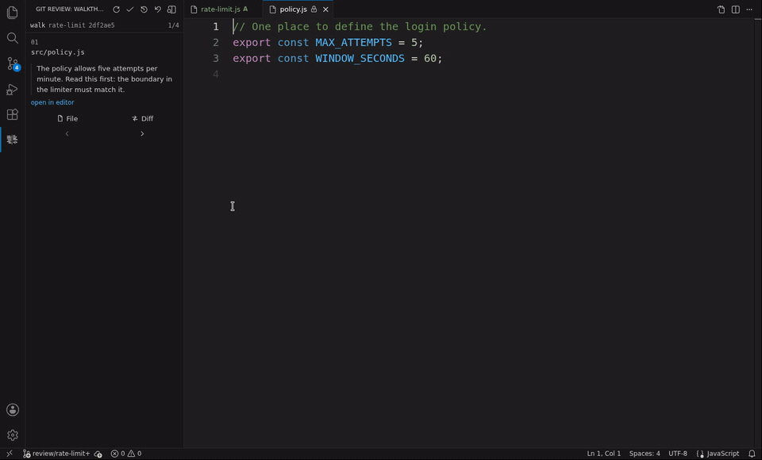
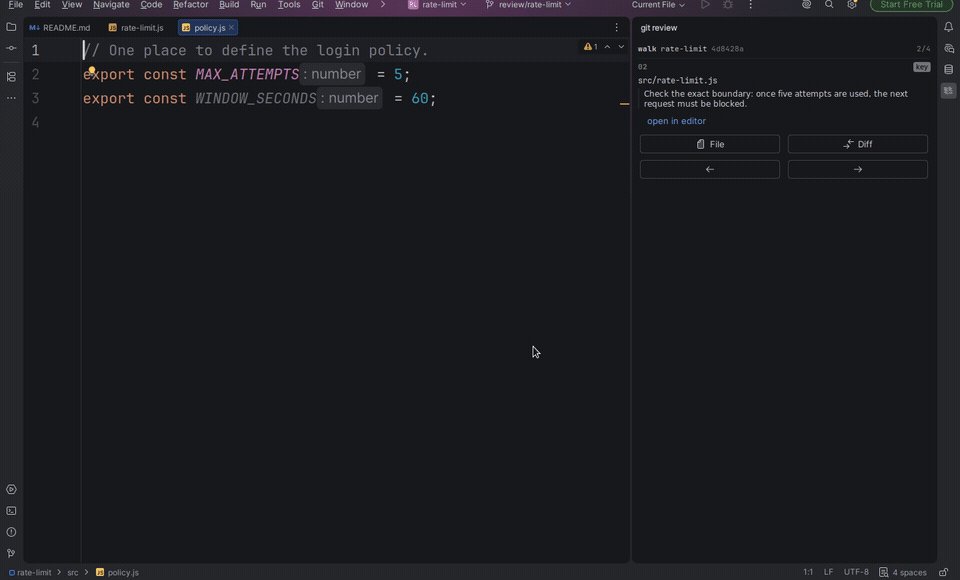
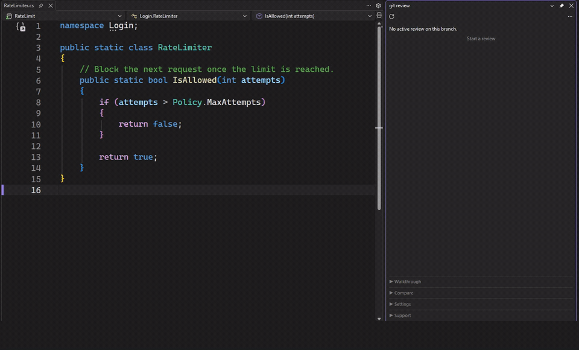

# git-review-workflow

> Review a pull request by **editing and running** it, not just reading it. The
> whole PR lands in your working tree as one staged diff; your fixes are then
> extracted onto a clean branch automatically. Re-review only what changed.
>
> And when an **AI agent** wrote the change, it can write the **reading order**
> too — a walkthrough committed next to the code saying which file to read first
> and why. The visual clients pick it up automatically and walk you through the
> diff in that order, instead of alphabetically.

[](LICENSE)
[](https://github.com/EzeVillo/git-review-workflow/releases)

**English** · [Español](README.es.md) · [Website](https://ezevillo.github.io/git-review-workflow/)

Interfaces: [VS Code extension](vscode-extension/README.md) · [JetBrains IDE plugin](jetbrains-plugin/README.md) · [Visual Studio extension](visualstudio-extension/README.md) · [terminal UI](tui/README.md)

Start from its VS Code, JetBrains, or Visual Studio panel, or use the terminal UI.
They guide the workflow while the [CLI](CLI.md) remains available for scripting
and advanced use.


**See the 40-second IDE demo above** — follow the reading order, fix the code,
run the tests, and take your correction to a separate branch.

<details>
<summary>See the workflow in each IDE</summary>







</details>

---

Reviewing in a web UI is fine for leaving comments, but poor for actually
*running* and *editing* the code. Starting a review puts the entire PR in your
working tree as **staged, uncommitted changes**. Because it is just your working
tree, you can open the whole PR in any editor, read the diff, edit inline, and
run the tests. When you finish, your edits are extracted onto a separate branch,
cleanly apart from the author's work. You can also re-review only what changed
after an update.

## Reviewing what an agent wrote

You asked an agent for a feature. It came back with fourteen changed files and a
diff sorted alphabetically — the one order guaranteed to say nothing about the
change. Reviewing that means reconstructing, file by file, reasoning you never
saw in the first place.

The agent that made the change is the one party that *does* know that reasoning.
As part of the same task, it can create a walkthrough that orders the changed
files, explains why each one matters, and travels with the PR.

Then you open the review in one of the visual clients. It finds the walkthrough
automatically, shows the agent's heads-up on what is delicate, and takes you to
the first file with its explanation. Essential entries are marked as key and the
panel moves through the rest of the order. The whole PR stays staged and editable
throughout, so you can fix what you find inline and finish with your corrections
on a separate branch.

To make it automatic, put this instruction where your agent will read it — its
`AGENTS.md`, `CLAUDE.md`, or your prompt template:

> After making and committing the change, add a reading walkthrough to the PR.
> Order the changed files, write a one-line *why* for each one, include a heads-up
> with what is delicate, mark the few entries a reviewer must not skim, validate
> the walkthrough, and commit it alongside the code.

The result is a plain committed Markdown file, so it also just reads on GitHub
for anyone who never installs this. And you get the same benefit **without the
author on board**: on a PR that carries no walkthrough, the panel can help you
ask your own agent to generate one just for your review.

Reviewing agent-written PRs is where the rest of the workflow pays off too: pull
the whole change into your working tree, actually run it, and fix the code smells
and subtle mistakes inline instead of writing comments about them.

## Why not just use my IDE's PR view?

Most tools let you *see* a PR. Two gaps this fills: *acting* on one — editing
and running it like ordinary working-tree changes, then handing your fixes back
without manual stashing or cherry-picking — and giving it a **guided reading
order**, something neither git nor GitHub offers natively.

|                                 |    View the PR    | Guided order + why, per file  | Edit & run as working tree | Auto-extract your fixes | Incremental re-review | Editor-agnostic |
|---------------------------------|:-----------------:|:-----------------------------:|:--------------------------:|:-----------------------:|:---------------------------------:|:---------------:|
| **git-review-workflow**         |         ✅         |               ✅               |             ✅              |            ✅            |                 ✅                 |        ✅        |
| `gh pr checkout` / `glab`       | ⚠️ plain checkout |               ❌               |             ✅              |            ❌            |                 ❌                 |        ✅        |
| JetBrains *Review Pull Request* |         ✅         |               ❌               |       ⚠️ in-IDE only       |            ❌            |                 ❌                 |        ❌        |
| VS Code *GitHub PR* extension   |         ✅         |               ❌               |       ⚠️ in-IDE only       |            ❌            |                 ❌                 |        ❌        |
| GitHub / GitLab web UI          |         ✅         |               ❌               |             ❌              |            ❌            |            ⚠️ partial             |        ✅        |

None of the alternatives above give you an **author-guided reading order** —
which file to read first, and why — instead of an alphabetical file list or a
bare diff. The author (often an AI coding agent) writes it once and commits it
alongside the PR. The reviewer panel detects it automatically and presents the
files in that order. You do not even need the author or your team on board: the
panel can help you create your own reading order for a single review.

Because the PR is just staged changes, anything that reads a Git diff sees all
of it — including AI coding agents like Claude Code or Codex that have no
PR-review feature of their own. Point one at the staged diff and it can review or
fix the whole PR in place.

And for the small stuff — a rename, a typo, a clearer variable name — fixing it
yourself is faster and less bureaucratic than leaving a comment and waiting for a
round-trip, especially when you are already looking at the PR in your editor.
Because your edits are extracted automatically, the fix costs about the same as
the comment would have. Or hand the staged diff to an agent and have it make the
change for you.

If you mostly *comment*, your IDE's native PR panel is enough. If you review by
editing and running the code — in any editor or agent — this is the gap it fills.

## Quick start

Every interface drives the same CLI, so install it first:

```sh
npm install -g git-review-workflow
```

Then choose the interface you want to work from:

| Interface | Start here |
|-----------|------------|
| **VS Code** | [Install the extension and open the git review panel](https://marketplace.visualstudio.com/items?itemName=EzeVillo.git-review-workflow) |
| **JetBrains IDEs** | [Install the plugin and open the git review tool window](https://plugins.jetbrains.com/plugin/33490-git-review-workflow) |
| **Visual Studio** | [Install the extension and open the Git Review panel](https://marketplace.visualstudio.com/items?itemName=EzeVillo.gitreviewworkflow) |
| **Terminal UI** | [Install and open the terminal interface](tui/README.md#getting-started) |

In a panel or the terminal UI, set the base branch once, then choose **Start a
review**. The interface asks which branch to review and how to read it. Edit and
run the staged change in your usual tools, then choose **Finish** to extract your
corrections onto a separate branch.

Prefer Homebrew, a native Windows (PowerShell) installer, or an install that
does not need Node? See [Installation](#installation). If you prefer scripting
or working directly from a shell, the [CLI reference](CLI.md) documents that
separate interface.

## Installation

The visual clients share a small command-line foundation. The
[Quick start](#quick-start) above already covers the npm install; expand below
for Homebrew, the native Windows installer, or a no-Node option.

<details>
<summary>Installation methods (npm, Homebrew, Windows, one-line, PATH)</summary>

Pick whichever method matches your setup. The package-manager options are the
easiest and **set up your `PATH` for you**.

### npm (recommended)

If you have [Node.js](https://nodejs.org), this is the one-command install. It
puts `git review` on your `PATH` for you and works on Linux, macOS and Windows
(on Windows the commands still run under Git Bash):

```sh
npm install -g git-review-workflow
```

Update with `npm install -g git-review-workflow@latest`; uninstall with
`npm uninstall -g git-review-workflow`. Tab completion is set up the same way as
the other non-Homebrew installs — see the note below.

### Homebrew (macOS / Linux)

```sh
brew tap EzeVillo/git-review-workflow https://github.com/EzeVillo/git-review-workflow
brew install EzeVillo/git-review-workflow/git-review-workflow
```

Tab completion is configured automatically. To update to the latest release:
`brew upgrade git-review-workflow`.

### Windows (PowerShell)

You still need [Git for Windows](https://gitforwindows.org), which provides the
shell these commands run in. Open PowerShell and run:

```powershell
irm https://raw.githubusercontent.com/EzeVillo/git-review-workflow/main/web-install.ps1 | iex
```

This installs the command into `~\.local\bin` and adds that folder to your user
`PATH` automatically. Open a new terminal after it finishes. Re-run to update; to
uninstall:

```powershell
irm https://raw.githubusercontent.com/EzeVillo/git-review-workflow/main/web-uninstall.ps1 | iex
```

(If you have Node, `npm install -g git-review-workflow` works on Windows too —
the commands still run under Git Bash either way.)

### One-line install (Linux, macOS, WSL, Git Bash)

No package manager? This downloads the command and installs it into
`~/.local/bin` — you don't need to clone the project first:

```sh
curl -fsSL https://raw.githubusercontent.com/EzeVillo/git-review-workflow/main/web-install.sh | sh
```

Re-run to update (always installs the latest release). To uninstall (pass the
same `PREFIX` if you overrode it):

```sh
curl -fsSL https://raw.githubusercontent.com/EzeVillo/git-review-workflow/main/web-uninstall.sh | sh
```

### Terminal UI (optional)

The terminal UI is a separate static binary and needs the CLI above. Install it
from the same Homebrew tap:

```sh
brew install EzeVillo/git-review-workflow/git-review-ui
```

Or opt into it when using a one-line installer (without the flag, those
installers continue to install only the CLI):

```sh
curl -fsSL https://raw.githubusercontent.com/EzeVillo/git-review-workflow/main/web-install.sh | GIT_REVIEW_WITH_UI=1 sh
```

```powershell
& ([scriptblock]::Create((irm https://raw.githubusercontent.com/EzeVillo/git-review-workflow/main/web-install.ps1))) -WithUi
```

The seven platform archives are also attached directly to each
[`tui-v*` release](https://github.com/EzeVillo/git-review-workflow/releases).
The [terminal UI guide](tui/README.md) covers launching it, its controls and the
fallback refresh setting for network mounts.

<details>
<summary>From a downloaded copy</summary>

If you cloned or downloaded the project, open its folder in a terminal and run:

```sh
./install.sh
```

This installs the `git review` dispatcher into `~/.local/bin` (change the
location with `PREFIX=/usr/local/bin ./install.sh`). The verbs travel beside it
as private helpers, not as separate commands on your `PATH`. Undo it any time
with `./uninstall.sh`. To update, just `git pull` inside the repo — the symlink
picks up changes automatically.
</details>

<details>
<summary>"command not found" — adding <code>~/.local/bin</code> to your PATH</summary>

Your `PATH` is the list of folders your terminal searches when you type a
command. Homebrew, npm and the PowerShell installer add their folder for you. The
one-line and manual installs use `~/.local/bin`, which is already on the `PATH`
on most systems. If it isn't, the installer prints a note — add it **once** by
pasting one line into your shell's config file:

| If your terminal uses…            | Add this line to the file…       | The line to add                        |
|-----------------------------------|----------------------------------|----------------------------------------|
| **bash**                          | `~/.bashrc`                      | `export PATH="$HOME/.local/bin:$PATH"` |
| **zsh** (default on recent macOS) | `~/.zshrc`                       | `export PATH="$HOME/.local/bin:$PATH"` |
| **fish**                          | *(no file — just run this once)* | `fish_add_path ~/.local/bin`           |

Not sure which one you use? Run `echo $0`. After editing the file, **open a new
terminal** (or `source` the file). Your visual client can then find the CLI.
</details>

<details>
<summary>Git Bash on Windows — SSL error during install?</summary>

If you see `schannel: next InitializeSecurityContext failed` or a
`revocation check` message, your Git for Windows is using the Windows SSL
backend. Fix it once, then re-run the installer:

```sh
git config --global http.sslBackend openssl
```

</details>

</details>

## CLI reference

The panels and terminal UI cover the normal workflow. For every command, flag,
recovery path and advanced flow, see the [complete CLI reference](CLI.md).

## Requirements

- Git 2.23+. Git 2.38+ is recommended for the most accurate comparison when a
  PR merges content from its base branch.
- A configured Git remote.
- A POSIX shell. On Linux and macOS this is the default. On Windows the commands
  run under Git Bash or WSL, not in `cmd.exe` or PowerShell.

## Contributing

Bug reports, fixes and ideas are welcome. See [CONTRIBUTING.md](CONTRIBUTING.md)
for how to run the tests and the release process.

## License

[MIT](LICENSE) © EzeVillo
