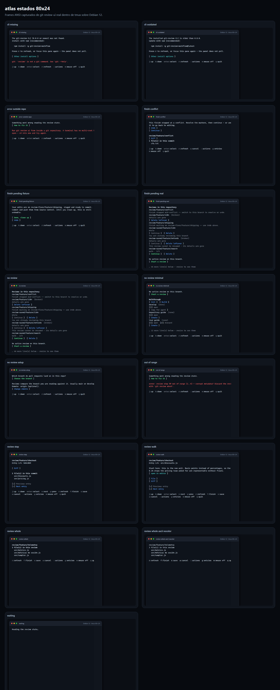
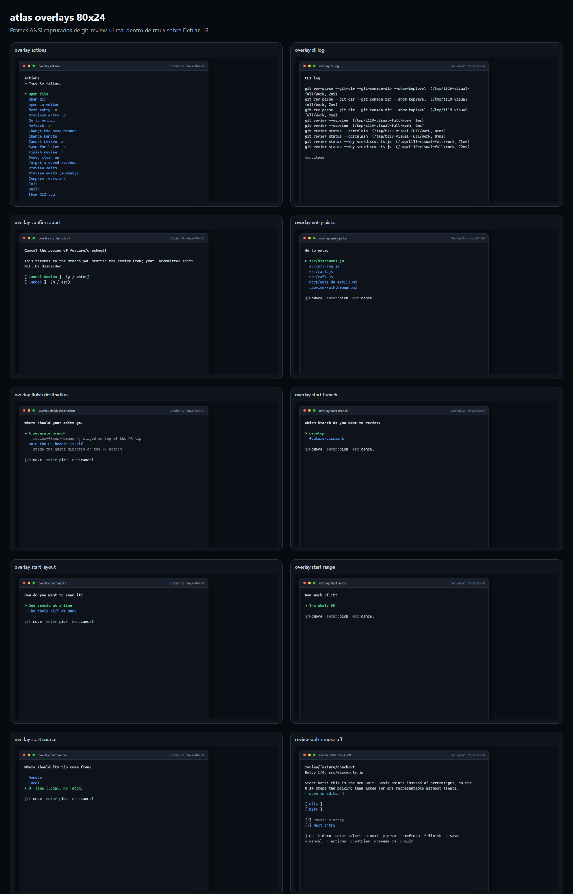
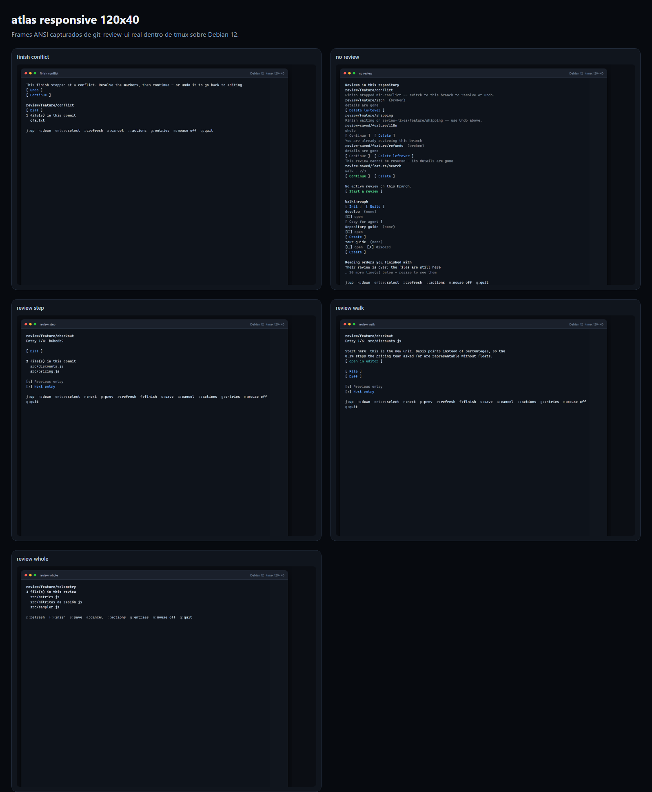
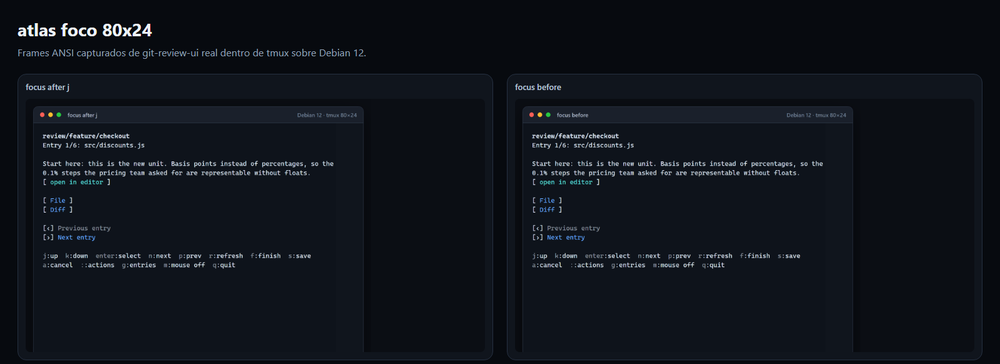

# Evaluación visual de la TUI en Linux

**Captura iniciada:** 2026-08-31  
**Evaluación cerrada:** 2026-09-01  
**Entorno:** Debian 12 amd64 en Docker, tmux 3.5a, Go 1.25.14, Git 2.47.3.  
**Binario:** `git-review-ui` construido desde este checkout.  
**Viewports:** 80×24 y 120×40.

## Veredicto

La TUI es visualmente limpia en los estados de review activa, respeta el ancho de los dos panes de
referencia, conserva Unicode y sigue siendo legible sin color y con glifos ASCII. Los estados de
error, selección y confirmación tienen una jerarquía clara.

No la consideraría lista para cerrar T119. La inspección visual encontró tres defectos de producto
que los golden y los gates actuales no detectan:

1. el foco de teclado es invisible;
2. el pie se trunca pero no scrollea, aunque el contrato y el gate afirman que existe una barra;
3. `finish-pending` se dibuja con una fixture controlada, pero no se alcanza desde el estado real que
   deja `finish`.

Además, la lista de acciones pierde su ayuda al pie en 80×24 y el asistente preselecciona la rama
base/corriente (`develop`) en vez del PR disponible.

## Cómo se produjeron las imágenes

No son mockups ni imágenes generadas por IA. Cada frame salió de un `git-review-ui` real ejecutado
en el alternate screen de tmux. `tmux capture-pane -e` conservó texto y atributos SGR; luego
`render-terminal.mjs` rasterizó esos bytes a PNG. La tipografía y la paleta final pertenecen al
rasterizador, porque un frame ANSI no contiene la fuente ni los valores RGB del emulador. La
geometría, el wrapping, el contenido, Unicode y los atributos bold/dim/color sí son los emitidos por
la TUI.

Se usaron los repos reales creados por `tests/sandbox.sh` y `tests/sandbox-min.sh`. Sólo
`cli-outdated`, la espera deliberadamente lenta y la vista contractual de `finish-pending` usan
stubs acotados; están identificados en los nombres de archivo.

## Atlas

### Estados a 80×24

### Overlays y flujo de inicio

### Comparación 120×40

### Foco antes y después de `j`

Los dos frames anteriores tienen el mismo SHA-256:
`84ae9f6b3e76ec5a2b4b7ac2957b9242b67c87bb1683169310b5a76f638ff0f2`.

## Hallazgos

### P1 — El foco de teclado no se dibuja

**Reproducción:** abrir una review walk en 80×24, capturar, pulsar `j`, volver a capturar. Los dos
frames ANSI son idénticos byte por byte aunque `FocusIndex` cambió.

**Impacto:** no se puede saber qué control activará `Enter`. El recorrido puede ser técnicamente
alcanzable, pero no es operable de forma consciente sólo con teclado; contradice SC-015 y la promesa
visual de `j:up` / `k:down`.

**Raíz:** `Model.Update` modifica `FocusIndex`, pero `Model.View` llama a `View(m.Panel,
m.Viewport)` y el renderer no recibe foco. El mouse tampoco mantiene estado de hover; sólo resuelve
el evento de presión.

**Cobertura que falta:** un test que exija un cambio visible al mover foco y que compruebe que el
control enfocado coincide con el que activará `Enter`.

### P1 — El pie no tiene el scroll único que declara FR-022

**Reproducción:** abrir el sandbox completo sin review. A 80×24 aparecen `45 more line(s) below`; a
120×40, `30 more line(s) below`. El propio mensaje dice `resize to see them`. No existe tecla,
offset, viewport ni barra para recorrer ese contenido.

**Impacto:** configuraciones, soporte, fixes y otras filas quedan invisibles. Esas filas también se
eliminan del `HitMap`, así que el recorrido sólo con mouse de SC-015 no puede alcanzarlas en un pane
real. El teclado conserva la lista completa de `ControlsFor`, por lo que puede recorrer y activar
controles que el usuario no ve, agravado por el foco invisible.

**Raíz:** `capFooter` corta las líneas y agrega un marcador. `ScrollbarCount == 1` es sólo una
constante verificada por `TestFooterCapAndSingleScrollbar`; no representa un componente de scroll.
El gate de mouse evita el problema usando un viewport artificial de 120×300.

**Cobertura que falta:** prueba interactiva a 80×24 y 120×40 que haga scroll hasta cada control,
compruebe una sola posición de scroll compartida y active el último control con teclado y mouse.

### P1 — `finish-pending` contractual no coincide con el ciclo real

**Reproducción:** el sandbox deja un cierre pendiente en
`review-fixes/feature/shipping`. La captura controlada muestra correctamente `[ Done, clean up ]` y
`[ Undo ]`; sobre el repo real, la TUI muestra el panel general `No active review` y entierra el
pendiente en el inventario.

**Impacto:** los dos controles principales del cierre pendiente no aparecen después del flujo real
que debería producirlos. Esto invalida la evidencia de “situación alcanzable” basada sólo en una
fixture y afecta SC-005/SC-001.

**Raíz:** `git review list --porcelain` marca `current=1` en la fila `fixes` cuando HEAD está en
`review-fixes/<src>`. `ReadState` decide `ListFinishPending` mirando únicamente una fila `branch`
con `Current == true`; esa combinación no es la que emite la CLI después de `finish`.

**Cobertura que falta:** integración host+CLI real: ejecutar un `finish` que quede pendiente, llamar
a `ReadState` desde la rama resultante y exigir `SituationFinishPending` con destino y source.

### P2 — La lista de acciones pierde su ayuda en 80×24

La paleta muestra las 20 acciones, pero `up/down:move  enter:run  esc:close` queda en la línea 25 y
`capOverlay` la descarta. La lista no tiene scroll. Hoy todas las acciones caben por un renglón; un
wrap, una traducción o una acción adicional recortaría acciones reales.

### P2 — El primer Enter del asistente apunta a `develop`

En el sandbox mínimo, `Which branch do you want to review?` preselecciona `develop`, la rama actual
y la base configurada, mientras `feature/discount` queda segunda. El flujo feliz del quickstart
requiere que la persona advierta esto y baje una fila antes de confirmar.

No lo marco como defecto contractual sin revisar la decisión de producto sobre ramas candidatas,
pero como UX el default es riesgoso: el camino más fácil no apunta al único PR de la fixture.

## Lo que sí funciona bien

- Ninguna captura desborda 80 o 120 columnas; el wrapping conserva palabras y caracteres Unicode.
- `src/café.js`, `docs/guía de estilo.md` y `src/métricas de sesión.js` se ven sin corrupción.
- `NO_COLOR=1` + `GIT_REVIEW_UI_ASCII=1` conserva filas, controles y alineación.
- Review walk, step y whole son distinguibles de inmediato.
- El conflicto de cierre tiene copy accionable y elimina correctamente `n`/`p` de la barra.
- Confirmaciones, pickers y log técnico reemplazan el frame completo; no dejan controles ambiguos
  activos detrás.
- `cli-missing`, `cli-outdated`, fuera de repo y out-of-range nunca quedan en blanco y muestran una
  salida accionable.
- La tecla de mouse cambia de `mouse off` a `mouse on` al desactivar reporting.

## Lectura de SC-001…SC-018 desde esta revisión visual

| Criterio | Resultado visual | Observación |
|---|---|---|
| SC-001 | Bloqueado | El ciclo principal se dibuja, pero el estado real posterior a `finish` no proyecta `finish-pending`. |
| SC-005 | Falla en integración | Las fixtures distinguen todas las situaciones; `finish-pending` no se alcanzó con la CLI real. |
| SC-009 | OK | Los estados capturados se mantuvieron dentro de 80×24 y 120×40. |
| SC-010 | OK | La muestra combinada sin color/ASCII es legible y conserva Unicode de paths. |
| SC-015 | Falla | Foco invisible y controles truncados impiden un recorrido honesto sólo teclado/mouse en panes reales. |
| SC-017 | Gate verde, insuficiente | Los golden detectan cambios de bytes, pero también congelan un layout sin foco y un pie sin scroll. |

Los demás criterios no son visuales y conservan la evidencia de `checklists/release.md`; esta
corrida no sustituye macOS, el instalador contra release público ni los pendientes ya documentados.

## Gates ejecutados durante esta evaluación

Pasaron, incluso con los defectos anteriores presentes:

- `TestGoldenFrames` (68 combinaciones);
- `TestEveryDeclaredControlIsReachableAndActivatableByKeyboardAlone`;
- `TestEveryDrawnControlIsReachableAndActivatableByMouseAlone`;
- `TestColonOpensTheActionListPerSituation`;
- `TestNoLineOverflowsAtReferenceSizes`;
- `TestLiveResizeRehashesLayoutAcrossSizes`;
- `TestFooterCapAndSingleScrollbar`.

Eso confirma que los hallazgos son huecos de cobertura y no fallos ya detectados por la suite.

## Recomendación de orden

1. Hacer visible el foco y el hover, con golden de transición antes/después.
2. Implementar un viewport de pie realmente desplazable y hacer que teclado, mouse y `HitMap`
   compartan el mismo rango visible.
3. Corregir la derivación real de `finish-pending` y agregar el test de integración con la CLI.
4. Hacer desplazable la paleta o reservar siempre su ayuda inferior.
5. Decidir explícitamente qué rama debe preseleccionar el asistente.

Hasta resolver los tres P1, T119 debería permanecer abierta.
